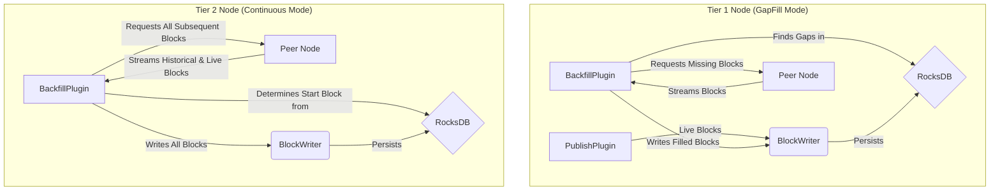
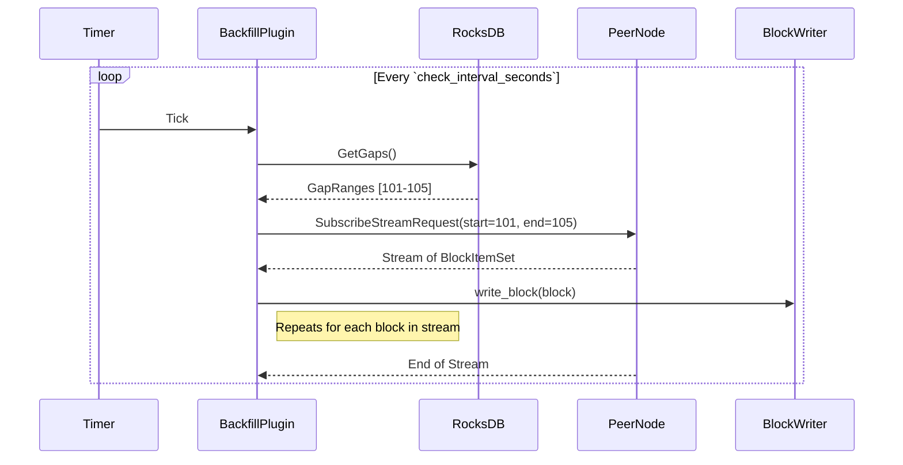
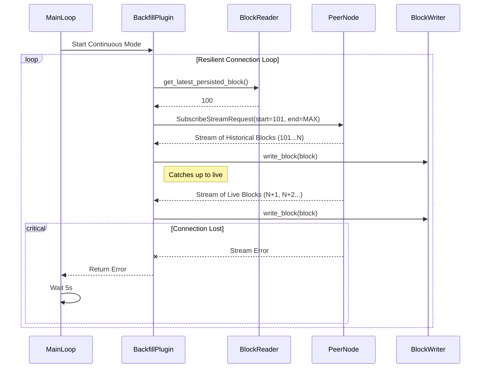

# Rock Node Backfill Plugin Design

## Table of Contents

1. [Introduction](#1-introduction)
   - [1.1 Purpose](#11-purpose)
   - [1.2 Goals](#12-goals)
2. [High-Level Architecture](#2-high-level-architecture)
3. [Configuration](#3-configuration)
4. [Operational Modes](#4-operational-modes)
   - [4.1 GapFill Mode (Tier 1)](#41-gapfill-mode-tier-1)
     - [4.1.1 Process Flow](#411-process-flow)
     - [4.1.2 Sequence Diagram](#412-sequence-diagram)
   - [4.2 Continuous Mode (Tier 2)](#42-continuous-mode-tier-2)
     - [4.2.1 Process Flow](#421-process-flow)
     - [4.2.2 Sequence Diagram](#422-sequence-diagram)
5. [Error Handling and Resiliency](#5-error-handling-and-resiliency)

---

## 1. Introduction

### 1.1 Purpose

The Rock Node architecture is designed to support a distributed network of nodes that ingest and persist a continuous stream of blocks. While the `PublishPlugin` handles live ingestion, interruptions are inevitable. Network issues, node downtime, or consensus delays can lead to missing blocks, or "gaps," in a node's local storage.

Furthermore, the architecture specifies two tiers of nodes:

- **Tier 1 Nodes**: Connect directly to consensus nodes, receiving the live block stream. They are primarily up-to-date but may suffer from transient gaps.
- **Tier 2 Nodes**: Do not connect to consensus. They rely entirely on other Rock Nodes (Tier 1 or other Tier 2) for their data, effectively acting as followers or replicas.

The Backfill Plugin is a unified, robust service designed to solve both of these challenges. It provides a single, configurable mechanism for a Rock Node to actively seek out and retrieve missing blocks from its peers, ensuring data completeness and enabling the tiered architecture.

### 1.2 Goals

- **Automated Gap Filling**: For Tier 1 nodes, automatically detect and fill any gaps in the historical block record.
- **Continuous Synchronization**: For Tier 2 nodes, provide the primary mechanism for ingesting the entire block history and staying synchronized with the live stream.
- **Resiliency**: Gracefully handle network interruptions, peer unavailability, and node restarts without manual intervention.
- **Efficiency**: Leverage existing gRPC streaming capabilities for low-latency data transfer once synchronized.
- **Architectural Cohesion**: Integrate seamlessly with the existing persistence pipeline (`BlockWriter`) to ensure all backfilled data undergoes the same validation and storage logic as live data.

---

## 2. High-Level Architecture (C4 Level 2)

The Backfill Plugin operates as a background service within the Rock Node. It functions as a gRPC client, connecting to the `BlockStreamSubscribeService` exposed by its peer nodes.

The key architectural principle is the re-use of the existing data pipeline. Instead of writing directly to the database, the Backfill Plugin ingests blocks from peers and pushes them into the `BlockWriter` provider. This ensures that all blocks, whether from a live stream or a backfill operation, are treated identically by the Persistence Plugin. This approach minimizes code duplication and guarantees data consistency.



---

## 3. Configuration

The plugin's behavior is controlled via a new `[plugins.backfill]` section in the `config.toml` file.

```toml
[plugins.backfill]
# Master switch for the plugin.
enabled = true

# Defines the operational strategy.
# "GapFill": For Tier 1 nodes. Periodically checks for and fills specific gaps.
# "Continuous": For Tier 2 nodes. Continuously syncs from a peer.
mode = "GapFill"

# A list of peer Rock Node subscriber service addresses (host:port).
peers = [
    "http://peer-node-1:50052",
    "http://peer-node-2:50052"
]

# How often the plugin checks for work (in seconds).
# Used for polling in GapFill mode and as a reconnection delay in Continuous mode.
check_interval_seconds = 60

# The maximum number of blocks to request in a single stream for GapFill mode.
# This prevents a single large gap from creating an unstable, long-running request.
max_batch_size = 1000
```

---

## 4. Operational Modes

The plugin's core logic is determined by the `mode` setting.

### 4.1 GapFill Mode (Tier 1)

Designed for nodes that are mostly up-to-date but need to repair holes in their history.

#### 4.1.1 Process Flow

- **Trigger**: The plugin's main loop is triggered by a periodic timer based on `check_interval_seconds`.
- **Gap Detection**: Query the local RocksDB instance, specifically the `CF_GAPS` column family, to retrieve a list of all known missing block ranges.
- **Batching**: For each identified gap, internally break the range into smaller chunks, respecting the `max_batch_size`. For example, a gap of 2,500 blocks with a `max_batch_size` of 1000 is processed as three separate requests: `[1000-1999]`, `[2000-2999]`, and `[3000-3499]`.
- **Peer Request**: Connect to a peer from the `peers` list and send a `SubscribeStreamRequest` for the first batch. This is a finite stream request with both a `start_block_number` and an `end_block_number`.
- **Ingestion**: As `BlockItemSet` messages arrive, reconstruct them into `Block` objects and immediately pass them to the `BlockWriter` service.
- **Completion & Iteration**: Once a batch is successfully streamed, move to the next batch for the current gap, or to the next gap if the current one is complete. The entire process repeats on the next timer tick.

#### 4.1.2 Sequence Diagram



### 4.2 Continuous Mode (Tier 2)

The primary data ingestion engine for a Tier 2 node. It is designed to be a persistent, resilient process.

#### 4.2.1 Process Flow

- **Trigger**: A single, persistent task loop is initiated when the plugin starts.
- **State Determination**: The loop's first action is to determine its starting point. It queries its own BlockReader to find the `latest_persisted_block_number`. The block to start fetching from is `latest_persisted + 1`.
- **Peer Connection**: Enter a resilient connection loop, attempting to connect to each peer in the `peers` list until successful.
- **Open-Ended Stream Request**: Once connected, send a single `SubscribeStreamRequest` with:
  - `start_block_number`: The calculated starting block.
  - `end_block_number`: `u64::MAX`. This tells the peer to send all blocks from the start number and then keep the stream open, sending new blocks as they become available.
- **Ingestion**: As blocks arrive (both historical catch-up and live), pass them to the `BlockWriter` service.
- **Resiliency**: If the stream breaks or the connection is lost, the function handling the stream returns an error. The main loop catches this error, waits briefly (e.g., 5 seconds) to prevent frantic retries, and then restarts the process from State Determination. Because it always re-queries the database for the latest persisted block, it seamlessly resumes exactly where it left off.

#### 4.2.2 Sequence Diagram



---

## 5. Error Handling and Resiliency

The plugin is designed to be self-healing and operate without manual intervention.

- **Peer Unavailability**: If a peer is down or unreachable, the plugin logs the error and immediately tries the next peer in the configured list.
- **Mid-Stream Disconnection**:
  - In GapFill mode, the failure is contained to a small batch. The partially filled gap will be smaller on the next cycle, and the process resumes automatically.
  - In Continuous mode, a disconnection triggers the main loop to restart. It re-queries the database for the last block it successfully persisted and starts a new stream from that point forward, ensuring no data is lost or duplicated.
- **Idempotency**: The database is the single source of truth for progress. The plugin does not maintain in-memory counters of its progress, making it resilient to crashes and restarts. The `BlockWriter` is the ultimate gatekeeper, preventing duplicate writes.

