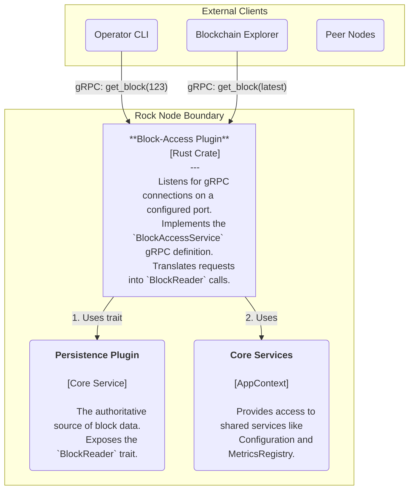
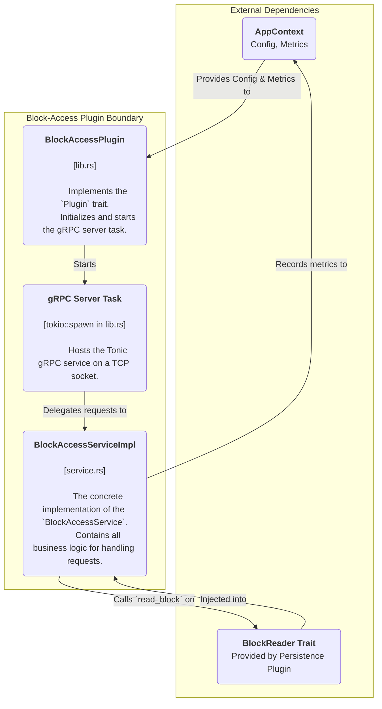

# Rock Node Block-Access Plugin Design

## Table of Contents

1. [Introduction](#1-introduction)
   - [1.1 Purpose](#11-purpose)
   - [1.2 Scope](#12-scope)
2. [High-Level Architecture](#2-high-level-architecture)
3. [Detailed Component Design](#3-detailed-component-design)
   - [3.1 Component Responsibilities](#31-component-responsibilities)
4. [Key Data Flows](#4-key-data-flows)
   - [4.1 get_block(number) Flow](#41-get_blocknumber-flow)
   - [4.2 get_block(latest) Flow](#42-get_blocklatest-flow)
5. [API Definition](#5-api-definition)
6. [Observability](#6-observability)
   - [6.1 Metrics](#61-metrics)
   - [6.2 Logging](#62-logging)

---

## 1. Introduction

### 1.1 Purpose

This document provides a detailed software design for the Block-Access Plugin. This plugin exposes a public-facing gRPC API that allows external clients and other Rock Node operators to query and retrieve blockchain data. Its primary goal is to provide a simple, robust, and performant access layer to the blocks stored by the PersistencePlugin.

### 1.2 Scope

The scope of this document covers the plugin's high-level architecture, its interaction with core node services, its detailed component design, primary data flows, and its observability strategy. It serves as the primary technical reference for the plugin's implementation and future maintenance.

---

## 2. High-Level Architecture (C4 Level 2)

The Block-Access Plugin is a consumer of the BlockReader trait, which is provided by the PersistencePlugin. It operates as a stateless service that translates incoming gRPC requests into calls against the BlockReader interface and formats the results into Protobuf-defined responses.

**Diagram 2.1:** Container-level view of the Block-Access Plugin.

---

## 3. Detailed Component Design (C4 Level 3)

The plugin's internal structure is streamlined, centered around the gRPC service implementation which acts as the main entry point and orchestrator.

**Diagram 3.1:** Internal components of the Block-Access Plugin.

### 3.1 Component Responsibilities

#### BlockAccessPlugin (lib.rs)

This struct implements the `rock-node-core::Plugin` trait. Its responsibilities are:

- **Initialization:** Stores the AppContext upon startup.
- **Service Startup:** Reads its gRPC listen configuration from the context. It retrieves a handle to the BlockReader service from the shared service providers. If the plugin is enabled and the BlockReader is available, it spawns the main gRPC server as a detached tokio task.

#### gRPC Server Task

A tokio task that builds and runs the `tonic::transport::Server`. It binds to the configured IP and port and directs all incoming traffic for the BlockAccessService to the BlockAccessServiceImpl.

#### BlockAccessServiceImpl (service.rs)

This is the heart of the plugin. It is a stateless struct that holds an `Arc` to the BlockReader and the MetricsRegistry. It implements the `get_block` RPC method, containing all logic for:

- Parsing the incoming BlockRequest.
- Determining the target block number (either a specific number or the latest).
- Calling the appropriate BlockReader methods.
- Handling all possible outcomes (success, not found, not available, database error).
- Deserializing block data and constructing the final BlockResponse.
- Recording detailed Prometheus metrics for every request.

---

## 4. Key Data Flows

### 4.1 get_block(number) Flow

1. A gRPC client sends a `BlockRequest` with the `block_number` field set to N.
2. `BlockAccessServiceImpl::get_block` is invoked.
3. The service calls `self.block_reader.read_block(N)`.

**Case A (Success):** `read_block` returns `Ok(Some(bytes))`. The service decodes the bytes into a `Block` protobuf message and embeds it in a `BlockResponse` with a `SUCCESS` status code.

**Case B (Not Found):** `read_block` returns `Ok(None)`. The service then queries `get_earliest_persisted_block_number` and `get_latest_persisted_block_number` to determine if N is outside the node's available range (`NOT_AVAILABLE`) or missing from within the range (`NOT_FOUND`).

**Case C (Error):** `read_block` returns `Err(_)`. The service logs the error and returns a `BlockResponse` with an `UNKNOWN` status.

Finally, duration and status code metrics are recorded before the response is sent.

### 4.2 get_block(latest) Flow

1. A gRPC client sends a `BlockRequest` with the `retrieve_latest` field set to `true`.
2. `BlockAccessServiceImpl::get_block` is invoked.
3. The service calls `self.block_reader.get_latest_persisted_block_number()`.
4. If a number L is returned, the flow proceeds as the `get_block(number)` flow with N = L.
5. If the persistence layer is empty (`Ok(None)`) or returns an error, an appropriate `BlockResponse` (`NOT_FOUND` or `UNKNOWN`) is returned immediately.

---

## 5. API Definition

The service exposes a single gRPC endpoint defined in the `rock-node-protobufs` crate.

**Service:** `BlockAccessService`

**RPC:** `get_block(BlockRequest) returns (BlockResponse)`

### BlockRequest

- `block_specifier`: A oneof field that can be either:
  - `block_number (u64)`: The specific block number to retrieve. A special value of `u64::MAX` is also treated as a request for the latest block.
  - `retrieve_latest (bool)`: An explicit request for the latest available block.

### BlockResponse

- `status (enum)`: A code indicating the result (`SUCCESS`, `NOT_FOUND`, `NOT_AVAILABLE`, `INVALID_REQUEST`, `UNKNOWN`).
- `block (Block)`: The requested block data, present only on `SUCCESS`.

---

## 6. Observability

The plugin is instrumented with Prometheus metrics via the shared MetricsRegistry to provide insight into its performance and behavior.

### 6.1 Metrics

#### `block_access_requests_total`
A Counter that tracks the total number of `get_block` requests.

**Labels:**
- `status`: The final status code of the request (e.g., "Success", "NotFound").
- `request_type`: The type of request ("by_number", "latest").

#### `block_access_request_duration_seconds`
A Histogram that measures the processing latency for `get_block` requests.

**Labels:**
- `status`: The final status code of the request.
- `request_type`: The type of request.

#### `block_access_latest_available_block`
A Gauge that indicates the block number of the latest block successfully served to a client.

### 6.2 Logging

The plugin uses the `tracing` library for structured logging.

- **DEBUG:** Detailed information about incoming requests.
- **INFO:** Plugin lifecycle events (initialization, starting).
- **WARN:** Non-fatal issues, such as a block being found in the database but being empty, or a request for a block that is within the known range but is unexpectedly missing.
- **ERROR:** Critical failures, such as the gRPC server failing to start or a database error during a read operation.