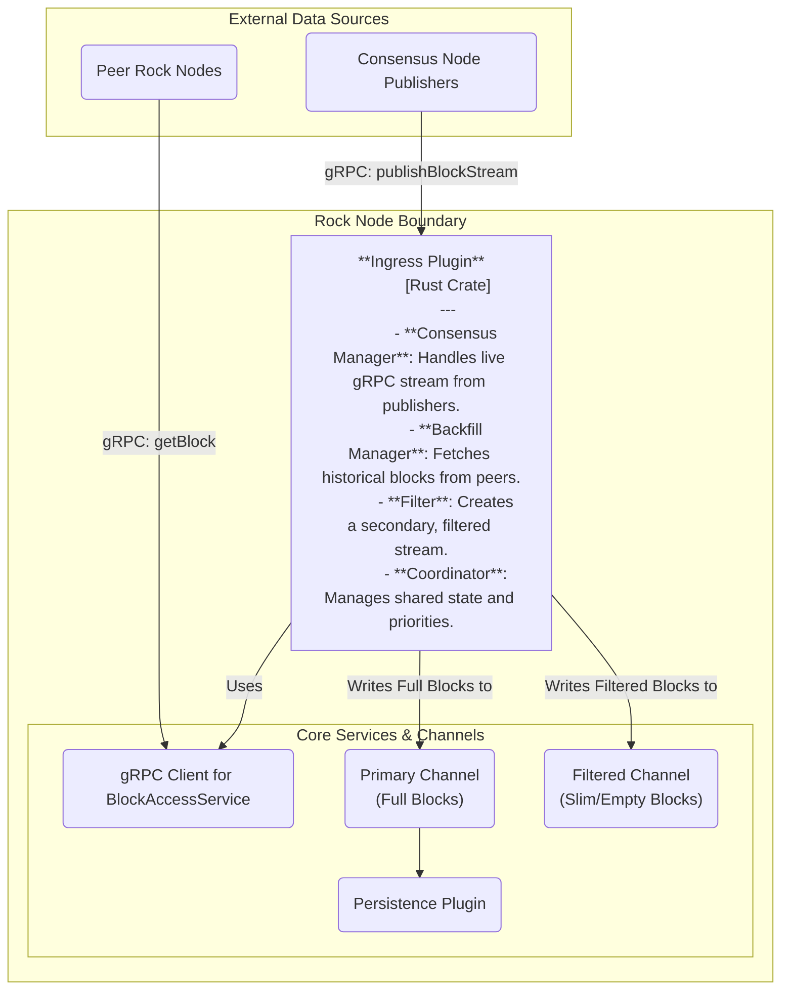
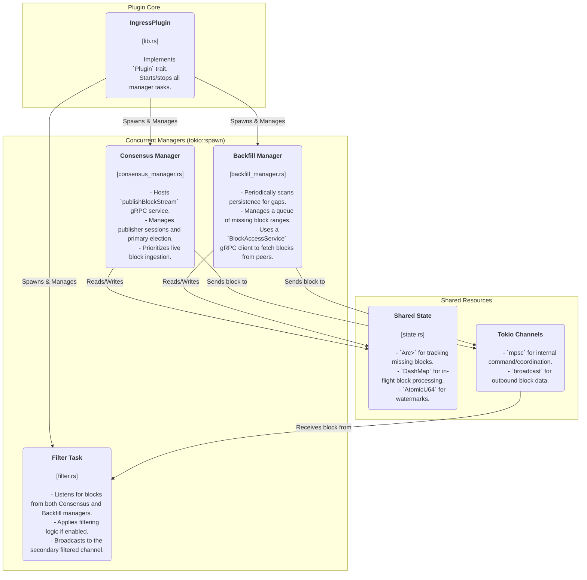

# Rock Node Ingress Plugin Design

## 1. Introduction

### 1.1 Purpose

This document provides the comprehensive software design for the Ingress Plugin. This plugin is the new primary entry point for all block data into the Rock Node. It is responsible for ingesting live blocks from consensus nodes, systematically backfilling historical block data from peer nodes to ensure data completeness, and providing an optional filtering mechanism for downstream consumers.

This plugin replaces the existing PublishPlugin, expanding its responsibilities to create a robust, resilient, and flexible data ingestion pipeline.

### 1.2 Scope

#### In-Scope

- The complete architecture and lifecycle of the IngressPlugin
- A dual-mode synchronization strategy, combining live "Consensus" streaming with historical "Backfill" fetching
- Coordination logic to ensure Consensus mode has priority over Backfill mode, preventing data duplication
- A gap-aware backfilling mechanism that can detect and fill multiple missing block ranges
- An additive filtering model that provides a secondary, filtered stream of blocks without altering the primary data pipeline
- Integration with a flexible start block configuration, allowing a node to bootstrap from any point in the blockchain's history
- Interaction with the gap-aware enhancements in the PersistencePlugin and StateManagementPlugin

#### Out-of-Scope

- The implementation of the PersistencePlugin's internal gap-tracking logic (this document assumes it exists)
- The implementation of downstream consumers of the filtered block channel

## 2. High-Level Architecture

The Ingress Plugin operates as a central orchestrator with three primary, concurrent components: the Consensus Manager, the Backfill Manager, and the Filter. It ingests data from external publishers (live) and peer nodes (historical), processes it, and then broadcasts it to the rest of the Rock Node system via internal channels.



*Diagram 2.1: High-level view of the Ingress Plugin and its interactions.*

## 3. Detailed Component Design

The plugin is composed of a main IngressPlugin struct that manages the lifecycle of its internal, long-running tasks.



*Diagram 3.1: Internal components of the Ingress Plugin.*

### 3.1 Component Responsibilities

#### Consensus Manager

This component is an evolution of the existing PublishPlugin. It will host the `publishBlockStream` gRPC service and manage all connected publisher sessions. Its core responsibility is to handle the "happy path" of receiving live, sequential blocks.

- **Primary Election**: It will retain the primary election logic to ensure only one publisher's data for a given block number is processed.

- **Coordination**: Before processing a block, it will check the shared state. If the BackfillManager is currently processing the same block, the ConsensusManager takes priority. It will signal the BackfillManager to cancel its attempt for that specific block.

#### Backfill Manager

This is a new, long-running background task responsible for data completeness.

- **Gap Detection**: On startup, the BackfillManager will perform an initial sweep of the persistence layer by querying its metadata (`earliest_persisted`, `latest_persisted`, and `highest_contiguous`). It will build an in-memory map of all known gaps.

- **Work Queue**: It will maintain a priority queue of gaps to fill, likely prioritizing older gaps first to move data to cold storage.

- **Fetching**: It will iterate through the configured list of peers in `config.toml`. For each missing block, it will make a unary `getBlock` request using a `BlockAccessService` gRPC client. If a peer does not have the block or returns an error, it will try the next peer in the list.

- **Configuration**: If the `backfill.peers` list in the configuration is empty, the BackfillManager will not start, and a WARN level log message will be emitted.

#### Filter

This component acts as a simple consumer-producer task.

- **Input**: It will listen on an internal channel that receives all blocks, whether from the Consensus or Backfill manager.

- **Logic**: If filtering is disabled, it does nothing. If enabled, it applies the defined filtering rules to the block.

- **Output**: It broadcasts the result (a full, slimmed-down, or empty block) on a dedicated, secondary broadcast channel for other plugins to consume. The primary block stream remains untouched.

## 4. Key Data Flows & Logic

### 4.1 Flexible Start Block & Conditional State

The node's startup behavior is decentralized; each plugin is responsible for its own initialization logic based on the global configuration.

#### Ingress Plugin Startup

During its start phase, the IngressPlugin will inspect the persistence layer.

- If persistence is empty, it will set its "next expected block" to the value of `core.start_block_number`.
- If persistence is not empty, it will set its "next expected block" to `latest_persisted_block + 1`, ignoring the configured start block.

#### State Management Plugin Startup

During its start phase, the StateManagementPlugin will inspect the configuration.

- If `core.start_block_number > 0`, the plugin will disable itself and log an informational message explaining that state cannot be built without a genesis block or a state snapshot.

> **TODO**: A note will be added indicating that a future StateSnapshotPlugin will enable this functionality by allowing the node to load a complete state at a specific block height.

### 4.2 Gap-Aware State & Persistence

The StateManagementPlugin and PersistencePlugin must now operate with the understanding that the block sequence is not necessarily complete.

#### State Management

Even if enabled (i.e., `start_block_number == 0`), the StateManagementPlugin will only apply state changes for contiguous blocks. It will process blocks from its last known point up to the `highest_contiguous_block_number` provided by the PersistencePlugin. It will then pause, waiting for the BackfillManager to fill the next gap.

#### Persistence

The PersistencePlugin's archiver will use the same `highest_contiguous_block_number` watermark. It will only move a chunk of blocks (e.g., 0-99) to cold storage once that entire range is contiguous and complete.

### 4.3 Inter-Plugin Communication & Data Flow

Communication between the Ingress, Verifier, and Persistence plugins is managed through a series of event channels defined in the shared AppContext. This creates a decoupled, configurable pipeline. The process uses a "claim check" pattern: the large BlockData is stored in a shared cache, and lightweight event messages containing a `cache_key` (a UUID) are passed between plugins.

The data flow supports two configurations, determined by whether the VerifierPlugin is enabled:

- **Verification Enabled**: Ingress → Verifier → Persistence
- **Verification Disabled**: Ingress → Persistence

The PersistencePlugin dynamically determines which flow is active at startup by checking the CapabilityRegistry.

```mermaid
sequenceDiagram
    participant IngressPlugin
    participant BlockDataCache
    participant VerifierPlugin
    participant PersistencePlugin

    Note over IngressPlugin, PersistencePlugin: Data Flow with Verification Enabled

    IngressPlugin->>BlockDataCache: 1. insert(BlockData) -> cache_key
    IngressPlugin->>VerifierPlugin: 2. send(BlockItemsReceived { cache_key })

    VerifierPlugin->>BlockDataCache: 3. get(cache_key) -> BlockData
    Note right of VerifierPlugin: Performs verification...
    VerifierPlugin->>PersistencePlugin: 4. send(BlockVerified { cache_key })

    PersistencePlugin->>BlockDataCache: 5. get(cache_key) -> BlockData
    Note right of PersistencePlugin: Writes block to disk...
    PersistencePlugin->>BlockDataCache: 6. mark_for_removal(cache_key)

    ---

    Note over IngressPlugin, PersistencePlugin: Data Flow with Verification Disabled

    IngressPlugin->>BlockDataCache: 1. insert(BlockData) -> cache_key
    IngressPlugin->>PersistencePlugin: 2. send(BlockItemsReceived { cache_key })

    PersistencePlugin->>BlockDataCache: 3. get(cache_key) -> BlockData
    Note right of PersistencePlugin: Writes block to disk...
    PersistencePlugin->>BlockDataCache: 4. mark_for_removal(cache_key)
```

*Diagram 4.1: Sequence of inter-plugin communication for block processing.*

## 5. Observability

### 5.1 Metrics

The Ingress Plugin will expose detailed Prometheus metrics:

- `ingress_active_consensus_sessions`: Gauge for active publisher connections
- `ingress_active_backfill_peers`: Gauge for peers currently being used for backfilling
- `ingress_blocks_ingested_total`: Counter with labels `{source="consensus|backfill", outcome="success|duplicate|stale"}`
- `ingress_backfill_gaps_detected_total`: Counter for the number of distinct block ranges identified as missing
- `ingress_backfill_gaps_pending`: Gauge for the number of gaps currently in the work queue
- `ingress_backfill_latency_seconds`: Histogram measuring the time taken to fetch a single block from a peer

### 5.2 Logging

#### INFO Level
- Plugin startup, shutdown
- New consensus connections
- Backfill process starting/finishing a major gap

#### WARN Level
- Backfill starting with no peers configured
- A peer failing to provide a block
- Consensus and backfill attempting to fetch the same block simultaneously (and the backfill yielding)

#### DEBUG Level
- Individual block fetch attempts
- Gap detection details
- Primary election results
