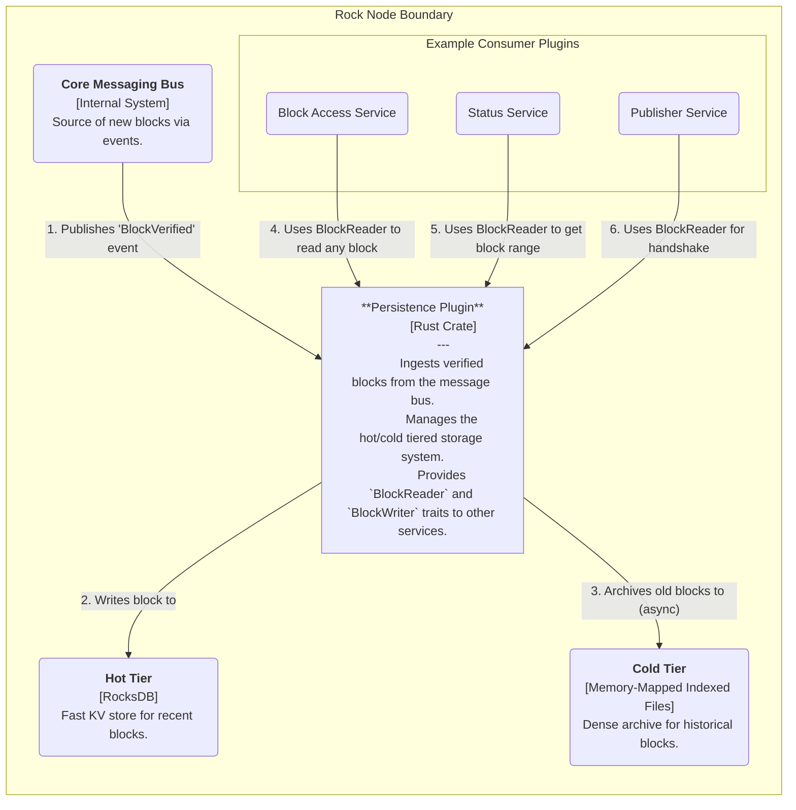
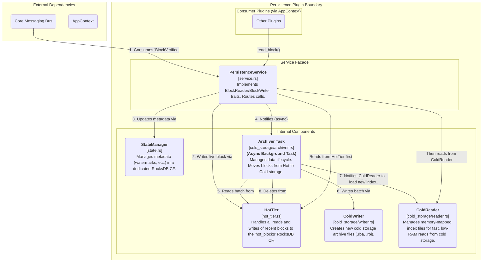

# Rock Node Persistence Plugin Design

## Table of Contents

1. [Introduction](#1-introduction)
   - [1.1 Purpose](#11-purpose)
   - [1.2 Scope](#12-scope)
2. [High-Level Architecture](#2-high-level-architecture)
3. [Detailed Component Design](#3-detailed-component-design)
   - [3.1 Component Responsibilities](#31-component-responsibilities)
4. [Key Data Flows](#4-key-data-flows)
   - [4.1 Live Block Write Flow](#41-live-block-write-flow)
   - [4.2 Block Read Flow](#42-block-read-flow)
   - [4.3 Archival Flow](#43-archival-flow)
5. [Data Model: Tiered Storage](#5-data-model-tiered-storage)
   - [5.1 Hot Tier (RocksDB)](#51-hot-tier-rocksdb)
   - [5.2 Cold Tier (Memory-Mapped Indexed Files)](#52-cold-tier-memory-mapped-indexed-files)
6. [Scalability Features and Future Improvements](#6-scalability-features-and-future-improvements)
   - [6.1 Implemented Scalability Features](#61-implemented-scalability-features)
   - [6.2 Future Improvements](#62-future-improvements)

---

## 1. Introduction

### 1.1 Purpose

This document provides a detailed software design for the Persistence Plugin of the Rock Node. This plugin is a foundational component responsible for the durable, long-term storage of the Hiero blockchain's block data. Its primary goal is to provide a reliable, efficient, and scalable storage layer that can handle a continuous stream of incoming blocks and serve historical data on demand.

### 1.2 Scope

The scope of this document covers the plugin's high-level architecture, its detailed internal components, the tiered storage data model, key data flows, and strategies for future scalability. It is intended to be the canonical technical reference for the plugin's implementation and future maintenance.

---

## 2. High-Level Architecture (C4 Level 2)

The Persistence Plugin is a core service within the Rock Node. It subscribes to events from the internal message bus to receive new blocks and exposes a unified data access interface (`BlockReader`, `BlockWriter`) for other plugins to use.

**Diagram 2.1:** Container-level view of the Persistence Plugin.

---

## 3. Detailed Component Design (C4 Level 3)

The plugin is a composite of several specialized components, each managing a distinct aspect of the storage system. The PersistenceService acts as the public-facing façade, orchestrating the internal components.

**Diagram 3.1:** Internal components of the Persistence Plugin.

### 3.1 Component Responsibilities

#### PersistenceService (service.rs)

The public entry point for the plugin. It implements the `BlockReader` and `BlockWriter` traits. It is responsible for writes to the hot tier and for routing read requests to the appropriate tier.

#### StateManager (state.rs)

The single source of truth for all storage metadata. It uses a dedicated metadata Column Family in RocksDB to atomically track crucial watermarks like `latest_persisted_block` and `earliest_hot_block`.

#### HotTier (hot_tier.rs)

The specialist for managing the `hot_blocks` Column Family in RocksDB. It provides an API to read, write, and delete recent block data. It is configured with a specific block cache size to ensure a predictable RAM footprint.

#### ColdWriter (cold_storage/writer.rs)

Responsible for creating the cold storage archive files. It takes a batch of blocks, compresses them with zstd into a `.rba` data file, and creates a corresponding `.rbi` index file.

#### ColdReader (cold_storage/reader.rs)

The specialist for reading from cold storage. On startup, it scans the cold storage directory and memory-maps the index (`.rbi`) files. This approach delegates memory management to the OS's virtual memory system, providing fast lookups with a minimal application RAM footprint.

#### Archiver (cold_storage/archiver.rs)

An asynchronous background task (`tokio::task`) that manages the data lifecycle. It is triggered by notifications from the PersistenceService after a write and also runs on a periodic schedule. It orchestrates moving blocks from the HotTier to Cold Storage.

---

## 4. Key Data Flows

### 4.1 Live Block Write Flow

1. The PersistencePlugin task receives a `BlockVerified` event from the message bus.
2. It calls `PersistenceService::write_block()`.
3. A `WriteBatch` is created for RocksDB.
4. The service adds the new block and metadata updates to the `WriteBatch`.
5. The `WriteBatch` is atomically committed to RocksDB.
6. The service sends a lightweight notification to the Archiver task, signaling that new data has arrived. This call is non-blocking and returns immediately.

### 4.2 Block Read Flow

1. An external plugin calls `PersistenceService::read_block(N)`.
2. The service first calls `HotTier::read_block(N)`. If the block is in RocksDB (and likely in its RAM cache), it's returned immediately.
3. If the HotTier returns `None`, the service delegates the call to `ColdReader::read_block(N)`.
4. The ColdReader identifies which memory-mapped index file should contain the block's metadata based on filename conventions.
5. It calculates the position of the `IndexRecord` within the memory-mapped slice and reads the block's location (offset and length) in the corresponding `.rba` data file.
6. It opens the `.rba` file, seeks to the offset, reads the compressed bytes, decompresses them, and returns the block data.

### 4.3 Archival Flow

1. The Archiver's background task wakes up, either from a notification or a periodic timer.
2. It checks the watermarks from the StateManager to determine if the number of blocks in the hot tier exceeds the configured threshold.
3. If an archival cycle is needed, the Archiver reads the oldest batch of blocks from the HotTier.
4. It commands the ColdWriter to create new `.rba` and `.rbi` files for the batch.
5. Upon success, the Archiver commands the ColdReader to load and memory-map the new index file.
6. Finally, the Archiver creates and commits a `WriteBatch` to RocksDB to delete the archived blocks from the HotTier and update the `earliest_hot` watermark.

---

## 5. Data Model: Tiered Storage

### 5.1 Hot Tier (RocksDB)

**Engine:** RocksDB, an embedded, high-performance key-value store.

**Purpose:** Low-latency storage for the most recent blocks. Its RAM usage is controlled by an explicitly configured LRU block cache.

**Column Families:**

- **metadata:** Stores global watermarks and state for the plugin.
- **hot_blocks:** Stores the actual block data.

**Key:** `u64` block number, encoded as big-endian bytes.

**Value:** Bincode-serialized `StoredBlock` struct.

### 5.2 Cold Tier (Memory-Mapped Indexed Files)

**Purpose:** Cost-effective, high-density, long-term archival of immutable historical blocks.

**Structure:** For each chunk of blocks, two files are created:

- **Data File** (`blocks-0...9999.rba`): Concatenated, zstd-compressed block data.
- **Index File** (`blocks-0...9999.rbi`): A binary file containing a sequential list of `IndexRecord` structs. This file is memory-mapped by the ColdReader for fast access.

**IndexRecord Struct:** A `repr(C, packed)` struct (20 bytes) containing the `block_number`, its byte offset within the `.rba` file, and its compressed length. This fixed-size layout allows for direct calculation of a record's position within the memory-mapped file.

---

## 6. Scalability Features and Future Improvements

### 6.1 Implemented Scalability Features

The following key scalability improvements have been implemented in the plugin.

#### 6.1.1 Asynchronous Archival

The Archiver has been decoupled from the synchronous write path and runs in its own dedicated `tokio::task`. This ensures that the process of moving data from the hot to the cold tier does not introduce latency spikes into the live block ingestion flow, resulting in consistently low write latency.

#### 6.1.2 Memory-Efficient Cold Index

The ColdReader's index is no longer held on the application heap. Instead, it uses memory-mapped (`mmap`) files. The operating system's virtual memory manager is responsible for paging index data from disk into RAM on demand. This design provides extremely fast lookups with a minimal and stable application RAM footprint, regardless of the size of the blockchain history.

### 6.2 Future Improvements

#### 6.2.1 Data Compaction and Deep Archival

**Problem:** Over many years, the number of individual cold storage chunk files could become very large, making filesystem management unwieldy. Furthermore, the zstd compression is optimized for a balance of speed and ratio; deeper archival could prioritize ratio over speed.

**Recommended Solution:** Introduce a "deep archival" background task. This task would run infrequently (e.g., nightly or weekly) and could:

- **Compact Chunks:** Take older, smaller archive chunks (e.g., 100 files of 10,000 blocks each) and merge them into a single, larger chunk file (e.g., one file for 1,000,000 blocks) to reduce inode usage.
- **Re-compress:** Use a slower but higher-compression algorithm (like xz) for very old data that is accessed infrequently.
- **Offload to Cloud:** For a cloud-native deployment, this task could be responsible for moving block archives older than a certain age (e.g., 1 year) to cheaper object storage like Amazon S3 Glacier. The ColdReader would need to be enhanced with a client to retrieve these blocks on demand.
