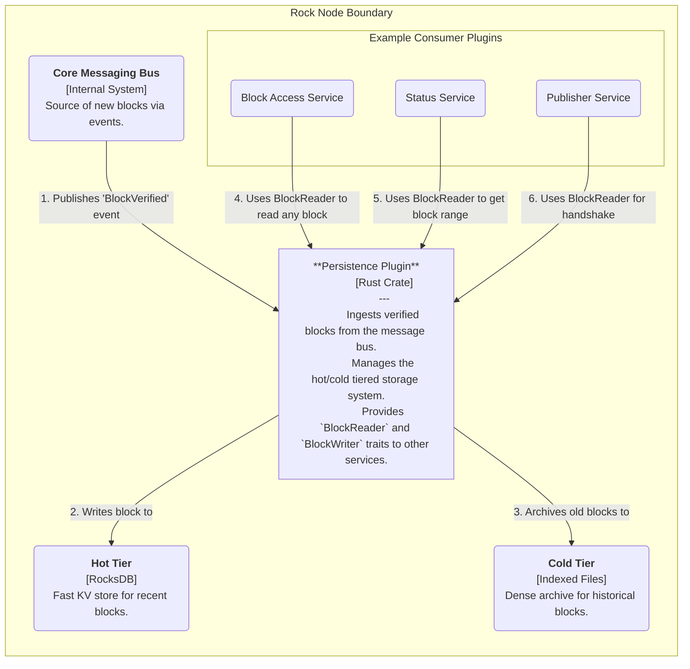
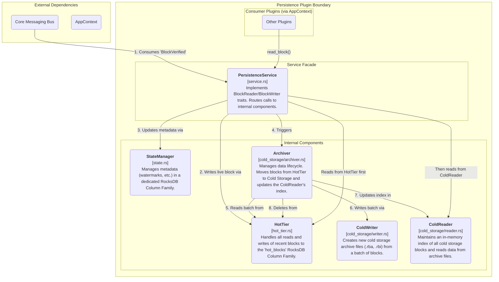

# Rock Node Persistence Plugin Design

## Table of Contents
1. [Introduction](#1-introduction)
2. [High-Level Architecture](#2-high-level-architecture)
3. [Detailed Component Design](#3-detailed-component-design)
4. [Key Data Flows](#4-key-data-flows)
5. [Data Model: Tiered Storage](#5-data-model-tiered-storage)
6. [Future-Proofing and Scalability](#6-future-proofing-and-scalability)

---

## 1. Introduction

### 1.1 Purpose

This document provides a detailed software design for the Persistence Plugin of the Rock Node. This plugin is a foundational component responsible for the durable, long-term storage of the Hiero blockchain's block data. Its primary goal is to provide a reliable, efficient, and scalable storage layer that can handle a continuous stream of incoming blocks and serve historical data on demand.

### 1.2 Scope

The scope of this document covers the plugin's high-level architecture, its detailed internal components, the tiered storage data model, key data flows, and strategies for future scalability. It is intended to be the canonical technical reference for the plugin's implementation and future maintenance.

---

## 2. High-Level Architecture (C4 Level 2)

The Persistence Plugin is a core service within the Rock Node. It subscribes to events from the internal message bus to receive new blocks and exposes a unified data access interface (`BlockReader`, `BlockWriter`) for other plugins to use.

**Diagram 2.1:** Container-level view of the Persistence Plugin.

---

## 3. Detailed Component Design (C4 Level 3)

The plugin is a composite of several specialized components, each managing a distinct aspect of the storage system. The `PersistenceService` acts as the public-facing façade, orchestrating the internal components.

**Diagram 3.1:** Internal components of the Persistence Plugin.

### 3.1 Component Responsibilities

#### PersistenceService (`service.rs`)
The public entry point for the plugin. It implements the `BlockReader` and `BlockWriter` traits defined in `rock-node-core`. It acts as a router, delegating all read, write, and archival operations to the appropriate specialized component.

#### StateManager (`state.rs`)
The single source of truth for all storage metadata. It uses a dedicated metadata Column Family in RocksDB to atomically track crucial watermarks like `latest_persisted_block`, `earliest_hot_block`, and the `true_earliest_persisted` block for the entire node.

#### HotTier (`hot_tier.rs`)
The specialist for managing the `hot_blocks` Column Family in RocksDB. It provides an API to read, write, and delete recent block data. All writes are performed via atomic `WriteBatch` operations.

#### ColdWriter (`cold_storage/writer.rs`)
Responsible for creating the cold storage archive files. It takes a batch of blocks, compresses them with zstd into a `.rba` (Rock Block Archive) data file, and creates a corresponding `.rbi` (Rock Block Index) file. It uses a write-to-temp → fsync → atomic rename pattern to ensure durability against crashes.

#### ColdReader (`cold_storage/reader.rs`)
The specialist for reading from cold storage. On startup, it scans the cold storage directory and builds an in-memory `DashMap` of every historical block's location for O(1) lookups. It exposes a method that allows the Archiver to load new index files in real-time.

#### Archiver (`cold_storage/archiver.rs`)
The background process that manages the data lifecycle. It is triggered after every live block write. It checks if the number of blocks in the hot tier exceeds a configured threshold. If it does, the Archiver coordinates reading a batch from the HotTier, commanding the ColdWriter to archive it, and upon success, commanding the ColdReader to load the new index before finally commanding the HotTier to delete the now-archived blocks.

---

## 4. Key Data Flows

### 4.1 Live Block Write Flow

1. The `PersistencePlugin` task receives a `BlockVerified` event from the message bus.
2. It calls `PersistenceService::write_block()`.
3. A `WriteBatch` is created.
4. The service calls `HotTier::add_block_to_batch()` to add the block write operation.
5. It calls `StateManager` methods to add metadata updates (e.g., `set_latest_persisted`, `initialize_earliest_hot`) to the same `WriteBatch`.
6. The `WriteBatch` is atomically committed to RocksDB.
7. The service calls `Archiver::run_archival_cycle()` to check if data needs to be moved to cold storage.

### 4.2 Block Read Flow

1. An external plugin calls `PersistenceService::read_block(N)`.
2. The service first calls `HotTier::read_block(N)`.
3. If the block is found, its bytes are returned immediately. The flow ends.
4. If the HotTier returns `None`, the service delegates the call to `ColdReader::read_block(N)`.
5. The ColdReader performs an O(1) lookup in its in-memory index for block N.
6. If a location is found, it opens the corresponding `.rba` file, seeks to the exact byte offset, reads the specified number of bytes, decompresses them, and returns the block data.
7. If no location is found, it returns `None`.

### 4.3 Archival Flow

1. The `Archiver::run_archival_cycle()` method is called.
2. It checks the `earliest_hot` and `latest_persisted` watermarks from the StateManager to calculate the number of blocks in the hot tier.
3. If `hot_block_count > hot_storage_block_count + archive_batch_size`, the process continues.
4. The Archiver calls `HotTier::read_block_batch()` to get the oldest batch of blocks.
5. It passes this batch to `ColdWriter::write_archive()`.
6. The ColdWriter creates the new `.rba` and `.rbi` files and returns the path to the new `.rbi` file.
7. The Archiver immediately calls `ColdReader::load_index_file()` with the new path, updating the in-memory index in real-time.
8. The Archiver creates a new `WriteBatch`, calling `HotTier::add_delete_to_batch()` for each archived block and `StateManager::set_earliest_hot()` to move the watermark forward.
9. The deletion batch is committed to RocksDB.

---

## 5. Data Model: Tiered Storage

### 5.1 Hot Tier (RocksDB)

**Engine:** RocksDB, an embedded, high-performance key-value store.

**Purpose:** Low-latency storage for the most recent blocks, which are queried most frequently.

**Column Families:**

- **`metadata`**: Stores global watermarks and state for the plugin.
  - **Keys**: Constant byte slices (e.g., `b"latest_persisted"`)
  - **Values**: `u64` integers

- **`hot_blocks`**: Stores the actual block data.
  - **Key**: `u64` block number, encoded as big-endian bytes for correct key ordering
  - **Value**: A bincode-serialized `StoredBlock` struct, which contains the Protobuf-encoded block bytes

### 5.2 Cold Tier (Indexed Flat Files)

**Purpose:** Cost-effective, high-density, long-term archival of immutable historical blocks.

**Structure:** For each chunk of blocks (e.g., 10,000 blocks), two files are created:

- **Data File** (`blocks-0...9999.rba`): A single file containing the concatenated, zstd-compressed Protobuf bytes of each block in the chunk, one after another.

- **Index File** (`blocks-0...9999.rbi`): A binary file containing a tightly packed, sequential list of `IndexRecord` structs.

**IndexRecord Struct:** A `repr(C, packed)` struct containing the `block_number`, its byte offset within the corresponding `.rba` file, and its compressed length. This fixed-size record (20 bytes: `u64`+`u64`+`u32`) allows for extremely fast lookups by seeking directly to `(block_number % chunk_size) * 20` in the index file.

---

## 6. Future-Proofing and Scalability Improvements

### 6.1 Asynchronous Archival

**Problem:** The current Archiver runs synchronously within the `write_block` call, which can introduce latency spikes.

**Recommended Solution:** Decouple the Archiver into its own dedicated `tokio::task`. This task can be triggered periodically (e.g., every 30 seconds) to check if an archival cycle is needed, transforming the process into an asynchronous background task and ensuring consistently low write latency.

### 6.2 Managing Large In-Memory Indexes

**Problem:** The ColdReader's in-memory `DashMap` of all historical block locations has an unbounded memory footprint.

**Recommended Solution:** Replace the heap-allocated map with memory-mapped (mmap) files using a crate like `memmap2`. The OS virtual memory manager would then be responsible for paging index data from disk into RAM on demand. This would dramatically reduce the node's baseline RAM usage and improve startup time, as the process would no longer need to read and parse all index files into the heap.

### 6.3 Data Compaction and Deep Archival

**Problem:** Over many years, the number of individual cold storage chunk files could become very large, making filesystem management unwieldy. Furthermore, the zstd compression is optimized for a balance of speed and ratio; deeper archival could prioritize ratio over speed.

**Recommended Solution:** Introduce a "deep archival" background task. This task would run infrequently (e.g., nightly or weekly) and could:

- **Compact Chunks**: Take older, smaller archive chunks (e.g., 100 files of 10,000 blocks each) and merge them into a single, larger chunk file (e.g., one file for 1,000,000 blocks) to reduce inode usage.

- **Re-compress**: Use a slower but higher-compression algorithm (like xz) for very old data that is accessed infrequently.

- **Offload to Cloud**: For a cloud-native deployment, this task could be responsible for moving block archives older than a certain age (e.g., 1 year) to cheaper object storage like Amazon S3 Glacier. The ColdReader would need to be enhanced with a client to retrieve these blocks on demand.

---

*This document serves as the canonical technical reference for the Rock Node Persistence Plugin implementation and maintenance.*