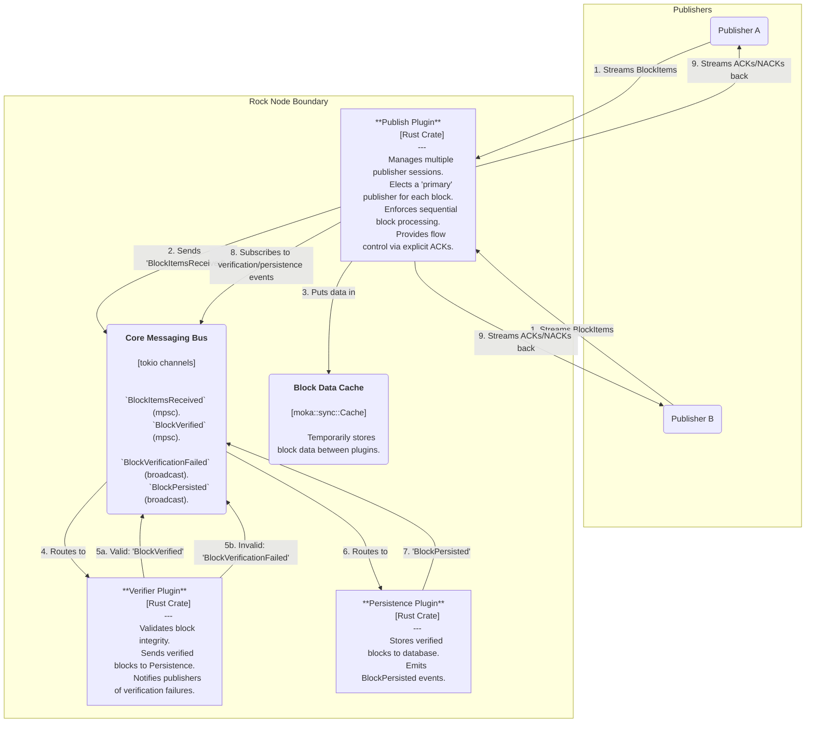

# Rock Node Publish-Plugin Design

## Table of Contents

1. [Introduction](#1-introduction)
   - [1.1 Purpose](#11-purpose)
   - [1.2 Scope](#12-scope)
2. [High-Level Architecture](#2-high-level-architecture)
3. [Detailed Component Design](#3-detailed-component-design)
   - [3.1 Component Responsibilities](#31-component-responsibilities)
4. [Key Data Flows & State Machine](#4-key-data-flows--state-machine)
   - [4.1 Primary Election Flow](#41-primary-election-flow)
   - [4.2 Primary Publisher Flow](#42-primary-publisher-flow)
5. [Shared State & Concurrency Control](#5-shared-state--concurrency-control)
6. [API Definition](#6-api-definition)
7. [Observability](#7-observability)
   - [7.1 Metrics](#71-metrics)
   - [7.2 Logging](#72-logging)
8. [Future-Proofing and Scalability](#8-future-proofing-and-scalability)
   - [8.1 Eviction of Stale "Winners"](#81-eviction-of-stale-winners)
   - [8.2 Stronger Memory Ordering for State](#82-stronger-memory-ordering-for-state)
   - [8.3 Dynamic Configuration](#83-dynamic-configuration)

---

## 1. Introduction

### 1.1 Purpose

This document provides the software design for the Publish Plugin. This plugin provides a gRPC endpoint for data producers (publishers) to stream block data into the Rock Node. It is designed to be highly concurrent, handling multiple simultaneous publisher connections while ensuring that blocks are processed sequentially, exactly once, and in order.

The plugin implements a **Publish → Verify → Persist** flow, integrating with the Verifier Plugin to ensure only valid blocks are persisted to storage. It provides robust flow-control to prevent fast publishers from overwhelming the node's verification and persistence pipelines, and implements graceful degradation by terminating publishers that send invalid blocks while allowing others to retry.

### 1.2 Scope

This document covers the plugin's architecture, including its use of bidirectional gRPC streaming, the session management state machine, the leader-election mechanism for block processing, and the shared state model. It is the canonical reference for the plugin's implementation.

---

## 2. High-Level Architecture (C4 Level 2)

The Publish Plugin exposes a bidirectional gRPC stream. Publishers connect and push BlockItem data to the server, and the server pushes back acknowledgements, flow-control messages, and error notifications. The plugin coordinates with the core messaging bus to ingest blocks, sending them to the Verifier Plugin for validation before persistence. It relies on both verification failure events and persistence success events for its flow-control loop.

**Diagram 2.1:** Container-level view of the Publish Plugin showing the Publish → Verify → Persist flow.

---

## 3. Detailed Component Design (C4 Level 3)

The plugin is composed of a central service implementation that spawns a dedicated SessionManager task for each incoming connection. These sessions coordinate through a SharedState object.

**Diagram 3.1:** Internal components of the Publish Plugin.

### 3.1 Component Responsibilities

#### PublishPlugin (lib.rs)

The main plugin entry point. It initializes the singleton `SharedState` instance, retrieves the node's latest known block from the BlockReader to hydrate the state, and starts the main tonic gRPC server, configuring TCP and HTTP/2 keepalives.

#### PublishServiceImpl (service.rs)

The gRPC service implementation. Its sole responsibility is to handle new incoming publisher streams. For each new connection, it increments a metrics gauge and spawns a new asynchronous tokio task to run a SessionManager instance, handing it the client's request stream and the server's response stream handle.

#### SessionManager (session_manager.rs)

The stateful workhorse of the plugin; one instance exists per active connection. It reads incoming `PublishStreamRequest` messages and processes them according to its internal state. It interacts with the `SharedState` to participate in the primary election for a given block. If it becomes primary, it is responsible for:

1. Collecting all BlockItems for a block
2. Publishing the completed block to the Verifier Plugin via the core messaging bus
3. Awaiting EITHER a verification failure OR a persistence success event
4. Sending the appropriate response (`Acknowledgement` for success, `EndOfStream(BAD_BLOCK_PROOF)` for verification failure, or `ResendBlock` for timeout) back to the client

The SessionManager ensures that blocks flow through the complete Publish → Verify → Persist pipeline before acknowledging them to the client, implementing graceful degradation by terminating publishers that send invalid blocks while allowing others to retry.

#### SharedState (state.rs)

A thread-safe object shared across all SessionManager instances. It contains:

- **block_winners:** A `DashMap<u64, Uuid>` used for the primary election. It maps a block number to the unique ID of the session that has won the right to publish it.
- **latest_persisted_block:** An `AtomicI64` that holds the highest block number confirmed to be durable. This is used to quickly reject duplicate or out-of-order (future) blocks.

---

## 4. Key Data Flows & State Machine

The core of the plugin is the "primary election" and subsequent state transitions within each SessionManager.

### 4.1 Primary Election Flow

1. A SessionManager receives the first `BlockItem` for block N, which must be a `BlockHeader`.
2. It reads `SharedState::latest_persisted_block` to perform initial validation.
3. If N < latest_persisted, it is behind. The server sends `EndOfStream(Behind)` and closes the connection.
4. If N == latest_persisted, it is a duplicate (already persisted). The server sends `EndOfStream(DuplicateBlock)` and closes the connection.
5. If N > latest_persisted + 1, it is a future block (gap). The server sends `EndOfStream(Behind)` and closes the connection.
6. If N == latest_persisted + 1 (the expected block), the session attempts to "win" the election by inserting its unique session ID into `SharedState::block_winners` for key N.
7. The `DashMap::entry().or_insert()` operation atomically guarantees that only one session can be the first to write its ID.

**Case A (Win):** The session's ID was successfully inserted. It transitions its internal state to `Primary`. It can now buffer `BlockItems`.

**Case B (Loss):** The session finds another session's ID already present. It transitions its internal state to `Behind`. It sends a `SkipBlock` message to its client and ignores all subsequent `BlockItems` for block N.

### 4.2 Primary Publisher Flow (State == Primary)

1. The primary SessionManager buffers all incoming `BlockItems` in memory.
2. Upon receiving the final item for the block (the `BlockProof`), it bundles all buffered items into a `Block` protobuf object.
3. It serializes the `Block` and places the bytes into the AppContext's `BlockDataCache`.
4. It sends a `BlockItemsReceived` event containing the block number and cache key to the core message bus, which routes it to the Verifier Plugin.
5. It now awaits EITHER a `BlockVerificationFailed` OR a `BlockPersisted` event for block N, with a 30-second timeout.

**Case A (Verification Success → Persistence Success):** A `BlockPersisted` event for block N arrives.

- The Verifier Plugin validated the block and sent it to Persistence.
- The Persistence Plugin successfully stored it and emitted `BlockPersisted`.
- The SessionManager sends a `BlockAcknowledgement` response to its client.
- It updates `SharedState::latest_persisted_block` to N.
- It removes N from the `SharedState::block_winners` map.
- It resets its internal state to handle the next block (N+1).
- **Flow Control:** The client can now send block N+1.

**Case B (Verification Failure):** A `BlockVerificationFailed` event for block N arrives.

- The Verifier Plugin detected the block is invalid (e.g., failed to decode, invalid signature, bad proof).
- The SessionManager sends an `EndOfStream(BAD_BLOCK_PROOF)` response to the failing client, terminating its connection.
- For all **other** active sessions (non-primary publishers), it sends a `ResendBlock` message so they can attempt to publish the block.
- It removes N from the `SharedState::block_winners` map to allow re-election.
- The primary session terminates, as the client needs to fix its data.

**Case C (Timeout):** No event arrives within 30 seconds.

- The SessionManager assumes a failure or delay in the verification/persistence pipeline.
- It sends a `ResendBlock` request to **all** active sessions, asking them to retry the block.
- It removes N from the `SharedState::block_winners` map so another session can retry.
- Flow control prevents runaway publishers - they must wait for the retry acknowledgement.

---

## 5. Shared State & Concurrency Control

- **Winner Election:** The `DashMap` provides a highly concurrent, lock-free mechanism for the primary election, which is the main point of contention.
- **Idempotency:** The `latest_persisted_block` atomic check provides a fast path for rejecting the vast majority of duplicate blocks without touching the more expensive `DashMap`.
- **Flow Control:** The publish → verify → persist → ACK loop is the primary mechanism for flow control. A publisher cannot send block N+1 until it has received an `Acknowledgement` for block N, ensuring blocks are verified and persisted sequentially. This prevents publishers from running ahead of the verification/persistence pipeline.
- **Verification Integration:** The SessionManager awaits BOTH `BlockVerificationFailed` and `BlockPersisted` events using `tokio::select!`, allowing it to react immediately to verification failures while maintaining the flow control guarantee. Failed verifications terminate the offending publisher while allowing other sessions to retry.

---

## 6. API Definition

The service is defined by a single bidirectional gRPC stream.

**Service:** `BlockStreamPublishService`

**RPC:** `publish_block_stream(stream PublishStreamRequest) returns (stream PublishStreamResponse)`

### Client-to-Server (PublishStreamRequest)

- **BlockItems:** A message containing a list of one or more `BlockItems`. A block stream begins with a `BlockHeader` and ends with a `BlockProof`.
- **EndStream:** A message from the client indicating it is gracefully closing the stream.

### Server-to-Client (PublishStreamResponse)

- **BlockAcknowledgement:** Sent when a block has been successfully received, verified, and persisted. The primary mechanism for flow control.
- **ResendBlock:** Sent to active sessions when:
  - The server timed out waiting for verification/persistence
  - Verification failed for the primary's block (sent to non-primary sessions only)
  - The client should resend all items for that block.
- **SkipBlock:** Sent to a non-primary publisher to tell it another publisher won the race and it should not send data for the current block.
- **EndOfStream:** Sent by the server when it is terminating the connection due to an unrecoverable error. Status codes include:
  - **DUPLICATE_BLOCK:** Block number ≤ latest persisted block
  - **BEHIND:** Block number > latest persisted block + 1 (future block)
  - **BAD_BLOCK_PROOF:** Block failed verification (invalid structure, signatures, or proof)
  - **END_STREAM_ERROR:** Generic error or client-initiated graceful close

---

## 7. Observability

### 7.1 Metrics

#### `active_publish_sessions`
A Gauge tracking the number of currently connected publishers.

#### `publish_items_processed_total`
A Counter for the total number of individual `BlockItems` processed.

#### `publish_blocks_received_total`
A Counter for blocks seen at the header stage.

**Labels:** `status` ("primary", "behind", "duplicate", "future_block").

#### `publish_responses_sent_total`
A Counter for responses sent to clients.

**Labels:** `type` ("Acknowledgement", "ResendBlock", "SkipBlock", etc.).

#### `publish_persistence_duration_seconds`
A Histogram measuring the time from when a primary sends a block for persistence until it gets the ACK.

**Labels:** `outcome` ("acknowledged", "timeout").

#### `blocks_acknowledged`
A Counter tracking the number of successfully persisted blocks via this plugin.

### 7.2 Logging

- **INFO:** New connections, session state transitions (becoming primary), successful block publications, and connection terminations are logged with the unique `session_id`.
- **WARN:** Duplicate/future blocks, persistence timeouts, and failures to send messages to a client (likely due to a disconnected client) are logged.
- **ERROR:** Critical failures like the gRPC server failing to start or failure to send an event on a core channel.

---

## 8. Future-Proofing and Scalability

### 8.1 Eviction of Stale "Winners"

**Problem:** If a publisher becomes primary for a block N and then crashes or disconnects without sending the full block, its session ID will remain in the `block_winners` map indefinitely. This will stall the node, as it will never be able to process block N.

**Recommended Solution:**

1. Change the `SharedState::block_winners` value from `Uuid` to a struct: `(Uuid, std::time::Instant)`.
2. When a session becomes primary, it stores its ID and the current time.
3. When a new session for block N finds an existing entry, it must check the `Instant`. If `Instant::elapsed()` is greater than a configurable timeout (e.g., 60 seconds), the new session can consider the previous winner "stale."
4. The new session should then use an atomic compare-and-swap operation on the `DashMap` entry to replace the stale winner with itself. This prevents a thundering herd of new sessions from all trying to replace the stale one simultaneously.

### 8.2 Stronger Memory Ordering for State

**Problem:** The `SharedState::latest_persisted_block` uses `Ordering::Relaxed`. While performant, this provides no causal guarantees between the update of the block number and other memory operations. A subtle race condition could occur where a thread sees the updated block number but not other state changes that should have happened before it.

**Recommended Solution:** Change the memory ordering for the atomic load and store operations to `Ordering::SeqCst` (Sequentially Consistent). This is the strongest guarantee and ensures a total global order of operations on the atomic variable, preventing reordering bugs. The performance cost for this variable, which is updated infrequently (once per block), is negligible and the safety gain is significant.

### 8.3 Dynamic Configuration

**Problem:** Key operational parameters, like the 30-second persistence timeout, are currently hardcoded as constants. This lacks flexibility for different deployment environments (e.g., development vs. production).

**Recommended Solution:** Move these parameters into the plugin's configuration struct in `rock-node-core`.

- `persistence_ack_timeout_seconds`: The timeout for awaiting a persistence event.
- `stale_winner_timeout_seconds`: The timeout for the stale winner eviction mechanism described above.

This allows operators to tune the system's behavior without recompiling the code.

### 8.4 Verification-First Architecture

**Design Decision:** The publish plugin was updated to implement a **Publish → Verify → Persist** flow instead of the original **Publish → Persist → Verify** approach.

**Rationale:**

1. **Data Integrity:** Invalid blocks never reach the persistence layer, preventing corruption of the database with bad data.
2. **Early Rejection:** Publishers sending invalid blocks are terminated immediately upon verification failure, saving resources on persistence attempts.
3. **Graceful Degradation:** The system matches the Java implementation's approach - if one publisher sends bad data, other publishers can retry the block without being affected.
4. **Simplified State Management:** By verifying before persisting, we eliminated the need for complex "unacknowledged blocks" tracking that would have been required to handle post-persistence verification failures.

**Implementation:** The SessionManager uses `tokio::select!` to await EITHER a `BlockVerificationFailed` event (broadcast channel) OR a `BlockPersisted` event (broadcast channel), allowing immediate reaction to failures while maintaining sequential flow control. This ensures publishers cannot send block N+1 until block N is both verified AND persisted.
