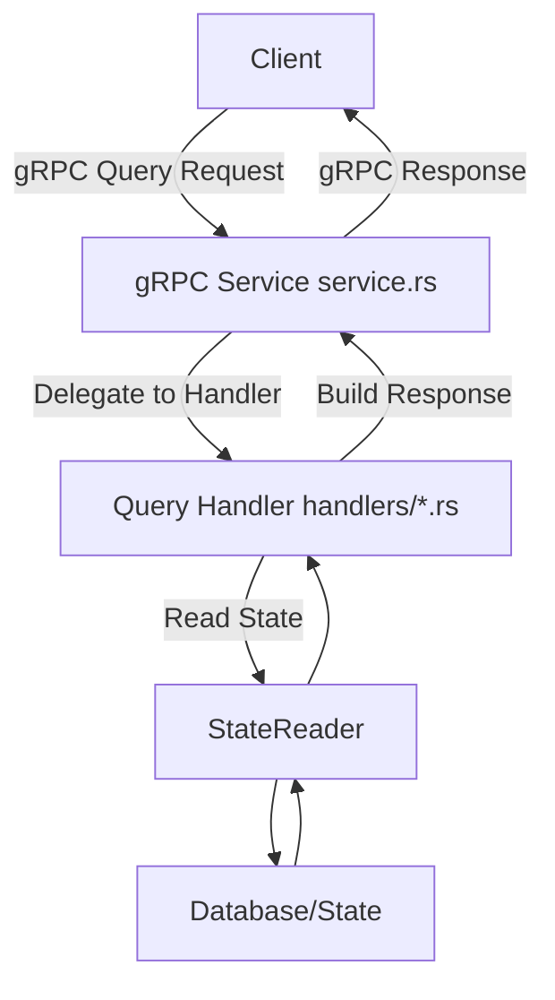

# Query Plugin Design Document

## Introduction

The Query Plugin provides gRPC-based query services for the Rock Node, implementing Hedera API (HAPI) query endpoints. It focuses on read-only operations, retrieving data from the node's state without modifying it. This plugin is crucial for clients needing to query account information, balances, and other blockchain state data.

Currently, it implements a subset of the CryptoService queries, with plans to expand to other services like TokenService, FileService, etc.

## Purpose

- Expose gRPC endpoints for HAPI queries.
- Handle query requests efficiently using the StateReader interface.
- Ensure separation of concerns between gRPC handling and business logic.
- Allow easy extension for new query types.

## Architecture

The plugin follows a modular architecture:
- **gRPC Service Implementation**: Handles incoming gRPC requests and responses.
- **Handlers**: Contain the business logic for processing specific queries.
- **Plugin Registration**: Integrates with the core application to start the gRPC server.

It depends on:
- `rock-node-core` for AppContext, Plugin trait, and StateReader.
- `rock-node-protobufs` for protobuf definitions.
- Tonic for gRPC server implementation.

The plugin is enabled/disabled via configuration in `config.toml` under `[plugins.query_service]`.

## Components

### 1. Plugin (plugin.rs)
This is the entry point that implements the Plugin trait. It:
- Initializes with AppContext.
- Starts the gRPC server if enabled.
- Retrieves the StateReader from service providers.
- Binds to the configured address and port.
- Registers the CryptoServiceImpl.

### 2. Service Implementation (service.rs)
Implements the gRPC service traits (e.g., CryptoService).
- Each method corresponds to a HAPI query or transaction.
- For queries: Extracts the inner query, delegates to a handler, wraps the result in a top-level Response.
- For unsupported methods: Returns NOT_SUPPORTED status.
- Uses Arc<dyn StateReader> for state access.

### 3. Handlers (handlers/crypto_handler.rs)
Business logic for specific query types.
- Each handler (e.g., CryptoQueryHandler) takes a StateReader.
- Methods like `get_account_info`:
  - Validate input.
  - Construct state keys.
  - Query state via StateReader.
  - Map state data to protobuf responses.
  - Handle errors and edge cases (e.g., account not found).

Handlers are modular; new ones can be added for other services.

### 4. Module Structure (mod.rs, lib.rs)
- `mod.rs`: Declares submodules like handlers.
- `lib.rs`: Exports the QueryPlugin for use in the main application.

## General Pattern for Handling Queries

For each query type, we follow this pattern:
1. In service.rs: Implement the gRPC method, extract the specific query, instantiate a handler with StateReader, call the handler method, and package the response.
2. In handlers/<service>_handler.rs: Implement the logic to:
   - Parse/validate the query.
   - Build state keys using protobuf encoding.
   - Retrieve data from StateReader.
   - Transform raw state data into HAPI response protobufs.
   - Return appropriate status codes (e.g., OK, INVALID_ACCOUNT_ID).
3. Use tracing for logging at different levels (trace, debug, etc.).
4. Handle errors with tonic::Status and anyhow::Result.

This pattern ensures consistency and makes it easy to add new queries by implementing the handler method and wiring it in the service.

### High-Level Flow Diagram

## Example: Handling GetAccountInfo Query

### In service.rs
The `get_account_info` method:
- Checks if the query is CryptoGetInfo.
- Creates a CryptoQueryHandler.
- Calls `handler.get_account_info(q)`.
- Wraps the result in TopLevelResponse.

### In crypto_handler.rs
The `get_account_info` function:
- Extracts account_id from query.
- Builds a state key for the accounts map.
- Queries StateReader for the account bytes.
- Decodes to Account protobuf.
- Maps fields to AccountInfo (e.g., balance, staking info).
- Builds response with header (OK or error code).
- If no account, returns INVALID_ACCOUNT_ID.

This example illustrates the flow; other queries (e.g., getAccountBalance, getTransactionReceipts) will follow similarly, querying relevant state maps and mapping to response types.

## Dependencies (Cargo.toml)
- rock-node-core: Core traits and types.
- rock-node-protobufs: Protobuf structs.
- tokio: Async runtime.
- tonic: gRPC framework.
- anyhow, tracing, prost, async-trait, hex: Utilities.

## Configuration
- `enabled`: Boolean to toggle the plugin.
- `grpc_address` and `grpc_port`: Listening address.

## Future Work
- Implement remaining CryptoService queries.
- Add support for other HAPI services (e.g., TokenService).
- Add authentication/authorization if needed.
- Performance optimizations for frequent queries.
- Integration tests for query endpoints.
