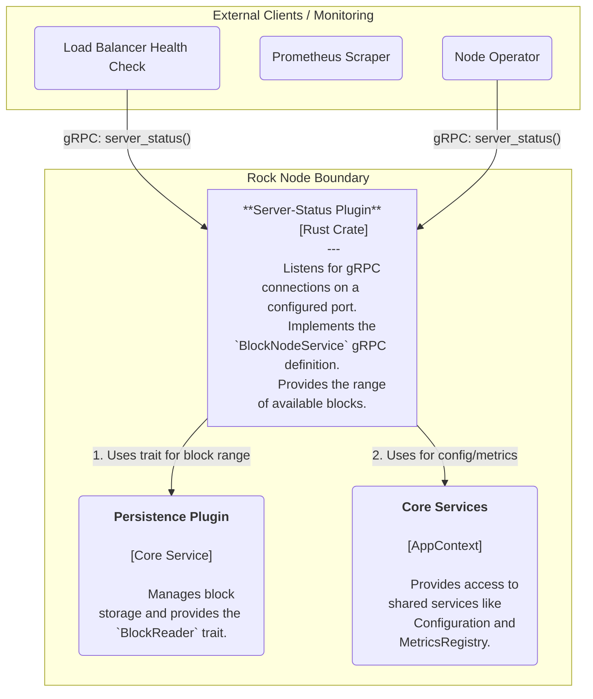
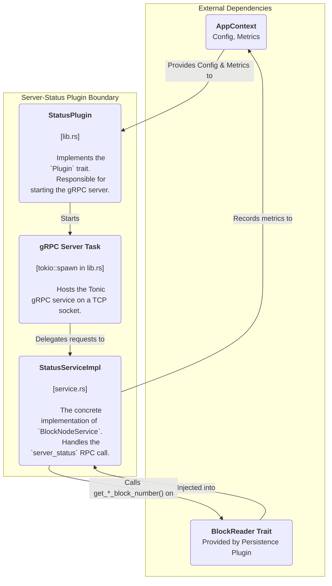

# Rock Node Server-Status Plugin Design

## Table of Contents

1. [Introduction](#1-introduction)
   - [1.1 Purpose](#11-purpose)
   - [1.2 Scope](#12-scope)
2. [High-Level Architecture](#2-high-level-architecture)
3. [Detailed Component Design](#3-detailed-component-design)
   - [3.1 Component Responsibilities](#31-component-responsibilities)
4. [Key Data Flow](#4-key-data-flow)
   - [4.1 server_status Request Flow](#41-server_status-request-flow)
5. [API Definition](#5-api-definition)
6. [Observability](#6-observability)
   - [6.1 Metrics](#61-metrics)
   - [6.2 Logging](#62-logging)

---

## 1. Introduction

### 1.1 Purpose

This document provides a detailed software design for the Server-Status Plugin. This plugin provides a simple health and status check endpoint for the Rock Node. Its primary goal is to offer a fast and lightweight way for clients, operators, and automated monitoring systems to determine the range of block data currently available on the node.

### 1.2 Scope

The scope of this document covers the plugin's architecture, its interaction with the PersistencePlugin via the BlockReader trait, its internal components, the server_status data flow, and its observability through metrics. It is the canonical technical reference for this plugin.

---

## 2. High-Level Architecture (C4 Level 2)

The Server-Status Plugin is a lightweight gRPC service that depends on the BlockReader trait to query storage metadata. It is a read-only component designed for high-availability, low-latency status checks.

**Diagram 2.1:** Container-level view of the Server-Status Plugin.

---

## 3. Detailed Component Design (C4 Level 3)

The plugin's internal design is minimal, comprising the plugin entry point and the gRPC service implementation that contains the core logic.

**Diagram 3.1:** Internal components of the Server-Status Plugin.

### 3.1 Component Responsibilities

#### StatusPlugin (lib.rs)

This struct implements the `rock-node-core::Plugin` trait.

- **Initialization:** Caches the AppContext provided by the node's core.
- **Service Startup:** On start, it reads its gRPC configuration from the AppContext, retrieves a handle to the BlockReader service, and, if enabled, creates and spawns the StatusServiceImpl within a tonic gRPC server task.

#### gRPC Server Task

A tokio task that runs the `tonic::transport::Server`. It is responsible for binding to a TCP port and dispatching all incoming BlockNodeService requests to the StatusServiceImpl.

#### StatusServiceImpl (service.rs)

The logical core of the plugin. It holds `Arc` references to the BlockReader and MetricsRegistry. It implements the `server_status` RPC method, which involves:

- Calling `block_reader.get_earliest_persisted_block_number()`.
- Calling `block_reader.get_latest_persisted_block_number()`.
- Handling potential database errors by returning a gRPC `Status::internal`.
- Handling an empty database (`Ok(None)`) by defaulting the block numbers to 0.
- Assembling the `ServerStatusResponse` with the retrieved block numbers.
- Updating Prometheus gauges and counters with the results and request latency.

---

## 4. Key Data Flow

### 4.1 server_status Request Flow

1. A client (e.g., a load balancer) sends an empty `ServerStatusRequest` to the gRPC endpoint.
2. `StatusServiceImpl::server_status` is called.
3. The service calls `self.block_reader.get_earliest_persisted_block_number()`.
4. The service calls `self.block_reader.get_latest_persisted_block_number()`.

**Case A (Success):** Both calls return `Ok(Some(num))` or `Ok(None)`. The numbers (or 0 for None) are placed into a `ServerStatusResponse`.

**Case B (Error):** Either call returns an `Err(_)`. The service logs the error and immediately returns a `tonic::Status::internal` error to the client, terminating the flow.

5. In the success case, the service updates the relevant Prometheus metrics.
6. The `ServerStatusResponse` is wrapped in a `tonic::Response` and sent back to the client.

---

## 5. API Definition

The service exposes a single RPC endpoint as part of the `BlockNodeService` definition from the `rock-node-protobufs` crate.

**Service:** `BlockNodeService`

**RPC:** `server_status(ServerStatusRequest) returns (ServerStatusResponse)`

### ServerStatusRequest

An empty message, acting as a simple trigger.

### ServerStatusResponse

- `first_available_block (u64)`: The lowest block number available on this node. Defaults to 0 if the node is empty.
- `last_available_block (u64)`: The highest block number available on this node. Defaults to 0 if the node is empty.
- `only_latest_state (bool)`: A field to indicate if the node is in a state where it only serves the latest state (currently hardcoded to false).
- `version_information (VersionInfo)`: An optional structure for versioning (currently unused).

---

## 6. Observability

The plugin provides metrics for monitoring its health and the status of the underlying data.

### 6.1 Metrics

#### `server_status_requests_total`
A Counter that tracks the total number of `server_status` requests.

**Labels:**
- `status`: The outcome of the request (currently always "success" unless a transport-level error occurs).

#### `server_status_request_duration_seconds`
A Histogram that measures the processing latency for `server_status` requests.

**Labels:**
- `status`: The outcome of the request.

#### `server_status_earliest_available_block`
A Gauge that reports the earliest block number available on the node.

#### `server_status_latest_available_block`
A Gauge that reports the latest block number available on the node.

### 6.2 Logging

The plugin uses the `tracing` library for key events.

- **DEBUG:** Logs the receipt of a `serverStatus` request.
- **INFO:** Reports plugin lifecycle events (initialization, starting) and the address the gRPC service is listening on.
- **ERROR:** Logs critical failures, such as the gRPC server failing to start or a database error when querying the block range.
