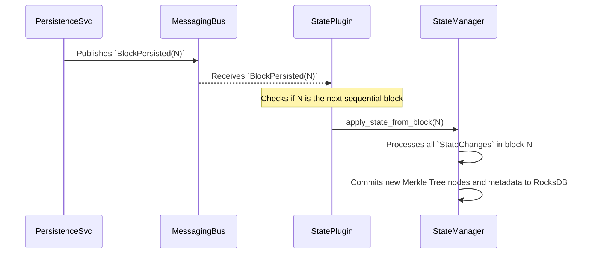
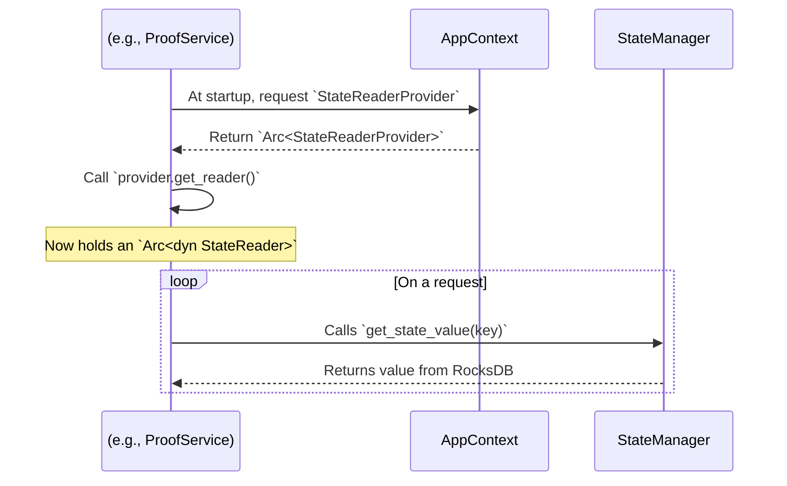

# State Management Plugin: Software Design Document

## 1. Introduction

### 1.1. Purpose

This document outlines the software design for the State Management Plugin (also referred to as the StateService). This plugin is a core component of the Rock Node application, responsible for maintaining the live, verifiable state of the ledger.

Its primary function is to consume blocks that have been successfully verified and persisted, process the state mutations contained within them, and commit these changes to a durable, high-performance database. The design is centered around a "Forest of Merkle Trees" architecture, which ensures the entire state is cryptographically verifiable, enabling future services like state proofs.

### 1.2. Scope

**In-Scope:**

- The complete design of the StatePlugin, including its lifecycle within the Rock Node application.
- A robust mechanism for ensuring sequential, atomic, and gap-free application of state changes from blocks.
- The detailed architecture of the verifiable state model: the "Forest of Merkle Trees" using Sparse Merkle Trees (SMTs).
- The RocksDB schema for persisting the Merkle trees and plugin metadata.
- A public, read-only StateReader trait for other plugins to query the state in a decoupled manner.
- Configuration options to enable or disable the plugin.

**Out-of-Scope:**

- The implementation of plugins that consume the state (e.g., QueryPlugin, ProofService). This document will, however, detail the interface that enables them.
- The implementation of a StateSnapshotPlugin. This design will ensure that the state is stored in a way that makes snapshotting straightforward for a future plugin.

## 2. Architectural Goals & Principles

- **✅ Verifiability**: The entire world state must be represented by a single root hash. It must be possible to generate compact Merkle proofs for any piece of state to prove its inclusion and value.

- **🔒 Consistency & Atomicity**: State transitions must be applied atomically. The plugin must never enter an inconsistent state where a block's changes are only partially applied. It must process blocks in strict sequential order.

- **💾 Durability**: The state must be persisted to disk and survive application restarts. The plugin must be able to resume processing from exactly where it left off.

- **🧩 Decoupling**: The plugin must integrate into the existing event-driven architecture. It will consume BlockPersisted events and provide its read capabilities via a shared trait (StateReader), without direct dependencies on other service implementations.

- **⚙️ Configurability**: Node operators must have the ability to enable or disable this plugin via the application's configuration file. A node focused purely on block ingestion and archival may not need to bear the computational and storage cost of maintaining the live state.

## 3. High-Level Architecture & Integration

### 3.1. Plugin Lifecycle & Configuration

The StatePlugin will be managed by the main application binary like any other plugin. Its activation is controlled by a simple boolean flag in `config.toml`.

**Configuration Example:**

```toml
# config/config.toml
[plugins.state_service]
# Set to true to enable state processing, or false to disable it.
enabled = true
```

The application entrypoint (`main.rs`) will read this configuration and conditionally instantiate the plugin:

```rust
// app/rock-node/src/main.rs (Conceptual)

// In main() after AppContext is built
let mut plugins: Vec<Box<dyn Plugin>> = vec![
    // ... other plugins
];

// Conditionally enable the State Plugin
if app_context.config.plugins.state_service.enabled {
    info!("StatePlugin is ENABLED.");
    plugins.push(Box::new(StatePlugin::new()));
} else {
    info!("StatePlugin is DISABLED.");
}

// ... initialize and start all assembled plugins
```

### 3.2. Event Flow & Service Provision

The plugin operates in a simple, event-driven loop and serves as a provider for other services.

#### Write Path (Event Consumption)

The plugin's primary input is the `BlockPersisted` event. This ensures it only ever processes blocks that are confirmed to be stored permanently.



#### Read Path (Service Provision)

During initialization, the StatePlugin registers a `StateReaderProvider` into the shared AppContext. Future plugins can then access the state without knowing about the StatePlugin itself.



## 4. Detailed Design: The Verifiable State Model

To achieve our goal of verifiability, the state will be modeled as a Forest of Sparse Merkle Trees (SMTs).

### 4.1. The "Forest of Trees" Structure

Instead of one monolithic tree, we maintain a separate SMT for each logical segment of the state, as defined by the `StateIdentifier` enum in `state_changes.proto`.

- **Individual State Trees**: One SMT for `STATE_ID_ACCOUNTS`, one for `STATE_ID_TOKENS`, one for `STATE_ID_CONTRACT_STORAGE`, etc.

- **State Root Hash**: A final, top-level root hash is computed by deterministically ordering and hashing the root hashes of all the individual state trees.

```
StateRootHash = Hash(Root(Tree_0) | Root(Tree_1) | ... | Root(Tree_N))
```

The order is determined by the numeric value of the `StateIdentifier` enum.

### 4.2. SMT for Map-Like State (e.g., Accounts)

Most state segments are key-value maps. Their SMTs will be structured as follows:

- **Leaves (🍃)**: A leaf represents a single entity (e.g., one account). The leaf node's value is the hash of its key and its data.

```
LeafHash = Hash(CanonicalKey | SerializedData)
```

  - **Key**: A canonical byte representation of the entity's ID (e.g., the `u64` number from `proto.AccountID`). The key determines the leaf's path in the 256-bit SMT.
  - **Data**: The value is the prost-serialized protobuf message (e.g., `proto.Account`).

- **Internal Nodes (↔️)**: An internal node is the hash of its left and right children.

```
InternalNodeHash = Hash(LeftChildHash | RightChildHash)
```

- **Empty Nodes**: SMTs use a placeholder hash for empty branches, allowing for efficient proofs of non-inclusion.

### 4.3. SMT for Singleton State (e.g., Running Hashes)

Singleton states (like `STATE_ID_RUNNING_HASHES`) are handled elegantly as a tree with a single leaf.

- **Key**: A constant, predefined key (e.g., `[0u8; 32]`).
- **Data**: The prost-serialized singleton protobuf message (e.g., `proto.RunningHashes`).
- **Root Hash**: The root of a singleton's "tree" is simply its `LeafHash`.

## 5. Detailed Design: Component Breakdown

### 5.1. StatePlugin

The public struct that implements the `Plugin` trait. Its responsibilities are minimal:

- Read the `[plugins.state_service]` config.
- On `initialize()`, create the `StateManager` and register the `StateReaderProvider`.
- On `start()`, spawn the main processing loop.

### 5.2. StateManager

The core logic resides here.

**State**: Holds `Arc<DatabaseManager>` and `Arc<BlockDataCache>`.

**Methods**:

- `get_last_processed_block() -> Result<Option<u64>>`: Queries the `CF_METADATA` column family in RocksDB for the `STATE_LAST_PROCESSED_BLOCK` key to determine the resume point.

- `apply_state_from_block(event: BlockPersisted) -> Result<()>`: The main write-path method. Its algorithm is:

  1. Retrieve the `BlockData` from the cache using the `event.cache_key`.
  2. Deserialize the data into a `proto::Block` message.
  3. Create an empty RocksDB `WriteBatch`.
  4. Iterate through `block.items`. For each `BlockItem` that is a `StateChanges` variant:
     - Iterate through the `state_changes` within.
     - For each `StateChange`, determine the target tree from `state_id` and the operation from `change_operation`.
     - Update the appropriate SMT. This involves calculating a new leaf hash, then walking up the tree to the root, re-calculating parent hashes along the way.
     - Add all new or modified SMT nodes to the `WriteBatch`.
  5. After processing all changes, add one final operation to the `WriteBatch`: `put(STATE_LAST_PROCESSED_BLOCK, event.block_number)`.
  6. Commit the `WriteBatch` to RocksDB atomically.

- `get_state_value(key: &[u8]) -> Result<Option<Vec<u8>>>`: Implements the `StateReader` trait. Queries the `CF_STATE_DATA` for a specific Merkle leaf to get its value.

### 5.3. StateReader and StateReaderProvider

These define the public, decoupled read API. This design anticipates that the `StateReader` trait will be expanded in the future.

- **Initial**: `get_state_value(key: &[u8]) -> Result<Option<Vec<u8>>>`
- **Future Extension for ProofService**: `get_merkle_proof(key: &[u8]) -> Result<MerkleProof>`

## 6. Data Persistence & Schema (RocksDB)

### CF_METADATA Column Family

Stores metadata about the plugin itself.

- **Key**: `b"state_last_processed_block"` (from rock-node-core)
- **Value**: `u64` block number, encoded as 8 big-endian bytes.

### CF_STATE_DATA Column Family

Stores all the nodes for all Merkle trees.

- **Key**: The path of a node in its SMT (a variable-length byte array, up to 32 bytes).
- **Value**: The hash of the node (a fixed-length 32 or 48-byte hash).

## 7. Interoperability & Future Considerations

This design explicitly enables future plugins.

### State Snapshots (StateSnapshotPlugin)

The entire state is self-contained within the RocksDB database directory. A snapshot plugin's job becomes remarkably simple:

1. Trigger a RocksDB checkpoint/backup to a new directory.
2. Archive and compress this directory.

To restore from a snapshot, the operator would simply replace the contents of the `data/database` directory with the snapshot's contents. The StatePlugin would then start, read the restored `state_last_processed_block` metadata, and resume operation seamlessly.

### State Proofs (ProofService)

The "Forest of Trees" model makes proofs efficient. The ProofService will use the `StateReader` to request a Merkle path for a specific key within a specific tree. This design ensures that the data required for proof generation is readily available and logically structured.