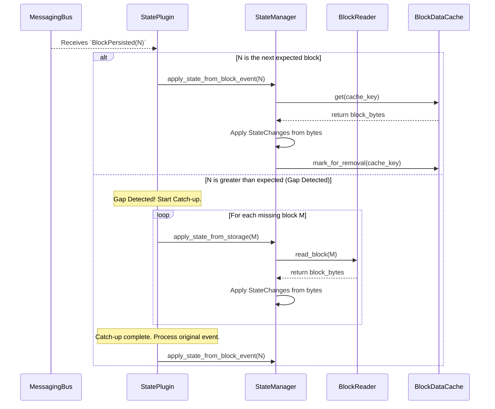

# State Management Plugin: Software Design Document

## 1. Introduction

### 1.1. Purpose

This document outlines the software design for the State Management Plugin. This plugin is a core component of the Rock Node application, responsible for maintaining the live, verifiable state of the ledger.

Its primary function is to consume `BlockPersisted` events, process the `StateChanges` contained within the associated blocks, and commit these mutations to a durable database. The design is centered around a "Forest of Merkle Trees" architecture to ensure the entire state is cryptographically verifiable, and it includes resilient "catch-up" logic to maintain consistency even if the live event stream is briefly interrupted.

### 1.2. Scope

#### In-Scope

- The complete design and lifecycle of the `StateManagementPlugin`
- A robust mechanism for ensuring sequential, atomic, and gap-free application of state changes, including a self-healing catch-up mechanism that reads from persistence
- The detailed architecture of the verifiable state model: the "Forest of Merkle Trees" using Sparse Merkle Trees (SMTs)
- A deferred-deletion cache (`BlockDataCache`) design to prevent race conditions
- The RocksDB schema for persisting Merkle trees and plugin metadata
- A public, read-only `StateReader` trait for other plugins to query the state
- Configuration options to enable or disable the plugin

#### Out-of-Scope

- The implementation of plugins that consume the state (e.g., `QueryPlugin`, `ProofService`)
- The implementation of a `StateSnapshotPlugin`

## 2. Architectural Goals & Principles

- **✅ Verifiability**: The entire world state must be represented by a single root hash, enabling compact Merkle proofs
- **🔒 Consistency & Atomicity**: State transitions must be applied atomically via `WriteBatch`. The plugin processes blocks in strict sequential order, starting from the genesis block (0)
- **🏃 Resilience**: The plugin must not halt if it falls behind the event stream. It must detect gaps and automatically "catch up" by reading missing blocks from the persistence layer
- **💾 Durability**: The state must be persisted to disk and survive application restarts, resuming from the exact last processed block
- **🧩 Decoupling**: The plugin consumes events and provides services via shared traits, without direct knowledge of other plugins
- **⚙️ Configurability**: Node operators must be able to enable or disable this plugin via the application's configuration file

## 3. High-Level Architecture & Integration

### 3.1. Plugin Lifecycle & Configuration

The plugin's activation is controlled by a simple boolean flag in `config.toml`.

```toml
# config/config.toml
[plugins.state_service]
enabled = true
```

### 3.2. Dependencies & Service Provision

Upon initialization, the `StateManagementPlugin` retrieves two service providers from the `AppContext`:

- **`DatabaseManagerProvider`**: For direct access to RocksDB
- **`BlockReaderProvider`**: To read historical blocks for the catch-up mechanism

It then registers its own `StateReaderProvider`, allowing other plugins like `ProofService` to query the live state.

### 3.3. Event Flow (Write Path)

The plugin's event loop is designed for resilience.



## 4. Detailed Design: Key Components

### 4.1. BlockDataCache with Deferred Deletion

To solve the race condition between multiple services consuming `BlockPersisted` events, the `BlockDataCache` uses a deferred deletion mechanism.

- **`mark_for_removal(key)`**: Instead of deleting data immediately, plugins call this async method
- **Cleanup Queue**: The method adds the key to an internal, de-duplicating `HashSet`
- **Background Task**: A `tokio::spawned` task within the cache wakes up every 10 seconds, drains the `HashSet`, and performs the actual remove operations from the underlying `DashMap`

### 4.2. StateManager

The core logic resides here.

**State**: Holds `Arc<DatabaseManager>`, `Arc<BlockDataCache>`, and `Arc<dyn BlockReader>`.

**Methods**:

- **`get_last_processed_block()`**: Reads the `STATE_LAST_PROCESSED_BLOCK` key from `CF_METADATA`
- **`apply_state_from_block_event()`**: The "hot path" that processes a block from the cache. After applying changes, it calls `cache.mark_for_removal()`
- **`apply_state_from_storage()`**: The "warm path" for the catch-up logic. It uses the `BlockReader` to fetch a block's bytes from persistence before applying changes
- **`apply_state_changes()`**: A private, shared method containing the core logic: deserialize block bytes, iterate `BlockItems`, process `StateChange` operations into a `WriteBatch`, and commit to RocksDB

### 4.3. StateManagementPlugin

This struct orchestrates the plugin's lifecycle. Its most critical logic is in the `start()` method's event loop, which now includes the catch-up logic described in the diagram above.

## 5. Verifiable State Model: Forest of Trees

The state is modeled as a Forest of Sparse Merkle Trees (SMTs), with one tree per `StateIdentifier` from the protobufs (e.g., `STATE_ID_ACCOUNTS`).

### Map-Like State (e.g., Accounts)

- **Leaves (🍃)**: `Hash(CanonicalKey | SerializedData)`
- **Internal Nodes (↔️)**: `Hash(LeftChildHash | RightChildHash)`

### Singleton State (e.g., Running Hashes)

Modeled as a tree with a single leaf whose key is a constant.

### Final State Root Hash

The root hashes of all individual trees are ordered by their `StateIdentifier` number, concatenated, and hashed to produce the final, single root hash for the block.

## 6. Data Persistence & Schema (RocksDB)

### CF_METADATA Column Family

- **Key**: `b"state_last_processed_block"`
- **Value**: `u64` block number (8 bytes, big-endian)

### CF_STATE_DATA Column Family

- **Key**: A composite key: `[state_id (u32)] | [serialized_entity_key]`
- **Value**: The serialized protobuf message for the entity (e.g., `proto.Account`)

## 7. Interoperability & Future Considerations

### State Snapshots

This design is snapshot-friendly. A future `StateSnapshotPlugin` can simply create a RocksDB checkpoint of the database directory. Restoring is a matter of replacing the directory contents.

### State Proofs

The "Forest of Trees" model enables efficient proof generation. A future `ProofService` can request Merkle paths for specific keys from a single tree, rather than the entire world state.
