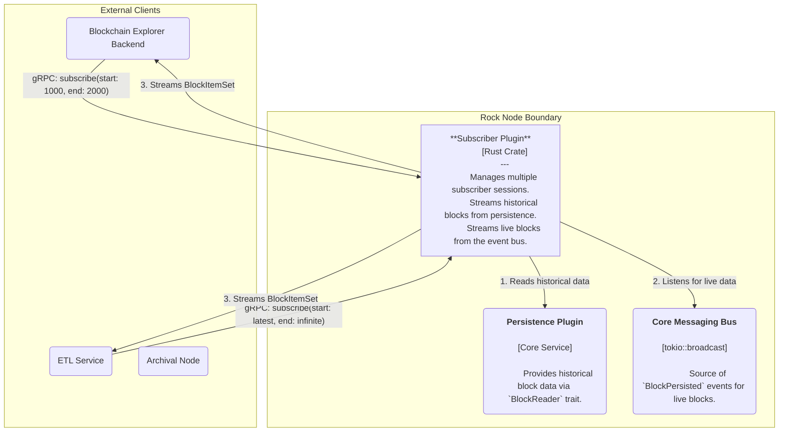
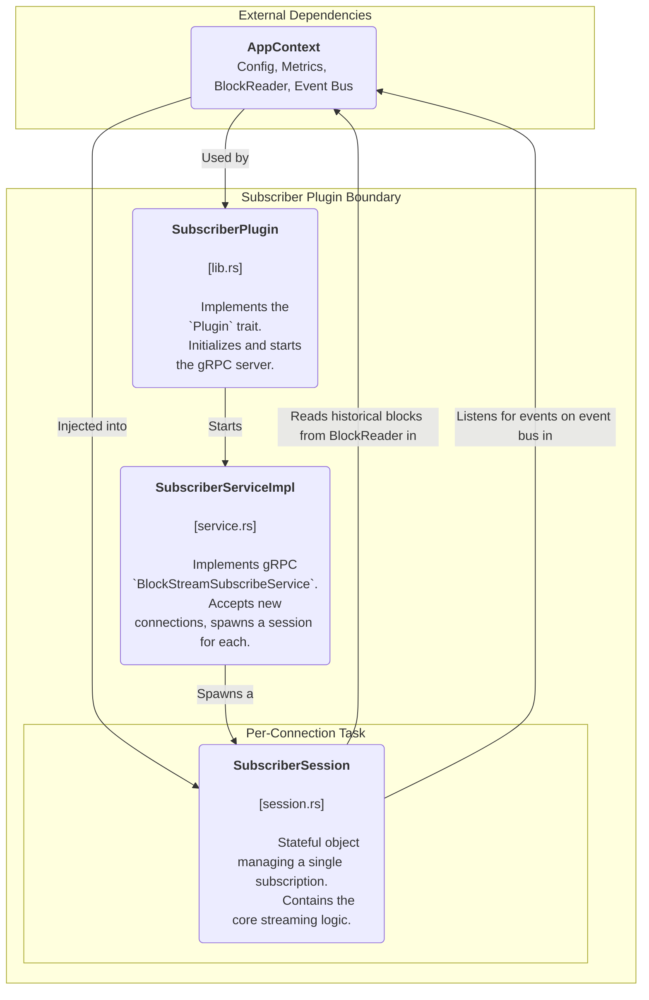

# Rock Node Subscriber-Plugin Design

## Table of Contents

1. [Introduction](#1-introduction)
   - [1.1 Purpose](#11-purpose)
   - [1.2 Scope](#12-scope)
2. [High-Level Architecture](#2-high-level-architecture)
3. [Detailed Component Design](#3-detailed-component-design)
   - [3.1 Component Responsibilities](#31-component-responsibilities)
4. [Key Data Flows](#4-key-data-flows)
   - [4.1 Finite Historical Stream](#41-finite-historical-stream)
   - [4.2 Live Stream](#42-live-stream)
5. [API Definition](#5-api-definition)
6. [Error Handling](#6-error-handling)
7. [Observability](#7-observability)
   - [7.1 Metrics](#71-metrics)
   - [7.2 Logging](#72-logging)
8. [Future-Proofing and Scalability](#8-future-proofing-and-scalability)
   - [8.1 Closing the "Wait" Race Condition](#81-closing-the-wait-race-condition)
   - [8.2 Per-Client Event Queues](#82-per-client-event-queues)
   - [8.3 Data Format Negotiation](#83-data-format-negotiation)

---

## 1. Introduction

### 1.1 Purpose

This document provides the software design for the Subscriber Plugin. This plugin exposes a public-facing gRPC endpoint that allows clients to subscribe to a stream of block data. It is designed to serve both finite historical ranges of blocks and open-ended "live" streams that receive new blocks as soon as they are persisted by the node.

### 1.2 Scope

The scope of this document covers the plugin's architecture, its server-side streaming gRPC implementation, its interaction with the PersistencePlugin and core eventing system, and its session management logic. It is the canonical reference for this plugin's implementation and maintenance.

---

## 2. High-Level Architecture (C4 Level 2)

The Subscriber Plugin is a consumer of both the BlockReader trait (for historical data) and the core BlockPersisted event bus (for live data). It accepts a request from a client and initiates a long-lived, server-to-client stream, pushing block data according to the client's criteria.

**Diagram 2.1:** Container-level view of the Subscriber Plugin.

---

## 3. Detailed Component Design (C4 Level 3)

The plugin's design centers on a stateless gRPC service that spawns a stateful SubscriberSession for each new connection. This encapsulates all logic for a single subscription, preventing crosstalk between clients.

**Diagram 3.1:** Internal components of the Subscriber Plugin.

### 3.1 Component Responsibilities

#### SubscriberPlugin (lib.rs)

This struct implements the `rock-node-core::Plugin` trait. Its primary responsibilities are to read its gRPC listener configuration from the AppContext and to start the main tonic gRPC server, which hosts the SubscriberServiceImpl.

#### SubscriberServiceImpl (service.rs)

A lightweight, stateless implementation of the `BlockStreamSubscribeService` gRPC trait. Its only function is to accept new incoming `SubscribeStreamRequests`. For each request, it creates a `SubscriberSession` instance and spawns it into a new tokio task to handle the entire lifecycle of the subscription.

#### SubscriberSession (session.rs)

This is the stateful core of the plugin. An instance is created for each client and lives for the duration of the stream. Its responsibilities are:

- **Initialization:** Validates the client's `SubscribeStreamRequest` against the available block range in the persistence layer.
- **Historical Sync:** Enters a loop to read consecutive blocks from the BlockReader and stream them to the client.
- **Live Streaming:** Once the historical sync is complete (or if the client requested a live stream from the start), it subscribes to the AppContext's `BlockPersisted` event channel.
- **Event Handling:** It waits for new block events, fetches the corresponding block from the BlockReader, and streams it to the client.
- **Termination:** It gracefully closes the stream when the requested end block is reached, a fatal error occurs, or the client disconnects.

---

## 4. Key Data Flows

### 4.1 Finite Historical Stream (start_block_number: 1000, end_block_number: 2000)

1. A `SubscriberSession` is created. It validates that block 1000 is available in the persistence layer.
2. It enters the main `execute_stream` loop.
3. The session calls `block_reader.read_block(1000)`. The block is found.
4. It decodes the block bytes and sends a `SubscribeStreamResponse` containing the `BlockItemSet` to the client.
5. It increments its internal counter to 1001 and repeats the process.
6. When the session sends block 2000, the loop condition `next_block_to_send > self.request.end_block_number` becomes true on the next iteration.
7. The session sends a final `SubscribeStreamResponse` with a `Status` of `ReadStreamSuccess` and terminates.

### 4.2 Live Stream (start_block_number: latest, end_block_number: u64::MAX)

1. A `SubscriberSession` is created. `validate_request` determines the latest available block is N.
2. The session enters the `execute_stream` loop. `next_block_to_send` is N.
3. It attempts to read block N+1 but `read_block` returns `Ok(None)`.
4. The session transitions to the `wait_for_new_block` state. It subscribes to the `BlockPersisted` event channel.
5. The node persists block N+1, and a `BlockPersisted` event is broadcast.
6. The session receives the event, and `wait_for_new_block` returns.
7. The main loop restarts. This time, `block_reader.read_block(N+1)` returns `Ok(Some(bytes))`.
8. The block is sent to the client, `next_block_to_send` is incremented to N+2, and the process repeats from step 3.

---

## 5. API Definition

The service is defined by a single server-streaming gRPC endpoint.

**Service:** `BlockStreamSubscribeService`

**RPC:** `subscribe_block_stream(SubscribeStreamRequest) returns (stream SubscribeStreamResponse)`

### Request (SubscribeStreamRequest)

- `start_block_number (u64)`: The first block number to send. `u64::MAX` is a special value requesting the earliest available block.
- `end_block_number (u64)`: The last block number to send. `u64::MAX` is a special value requesting an infinite, live stream.

### Response (SubscribeStreamResponse)

A oneof containing either:

- **BlockItemSet:** A set of `BlockItems` that constitute a single block.
- **Status (enum):** A final status code sent just before the stream is closed, indicating the reason for termination (e.g., `ReadStreamSuccess`, `ReadStreamInvalidStartBlockNumber`).

---

## 6. Error Handling

The `SubscriberError` enum (`error.rs`) defines all possible internal error states. This enum has two key methods:

- **`to_status_code()`:** Maps an internal error to the appropriate Protobuf `Code` enum to be sent to the client in the final `Status` message. This prevents leaking internal implementation details. For example, both `Persistence` and `TimeoutWaitingForBlock` errors map to the generic `ReadStreamNotAvailable`.
- **`to_metric_label()`:** Maps an internal error to a descriptive string label for the `subscriber_sessions_total` Prometheus metric, allowing for detailed operational monitoring.

---

## 7. Observability

### 7.1 Metrics

#### `subscriber_active_sessions`
A Gauge tracking the number of currently active subscription streams.

#### `subscriber_sessions_total`
A Counter for the total number of sessions initiated.

**Labels:** `outcome` (e.g., "completed", "invalid_request", "timeout", "client_disconnect").

#### `subscriber_blocks_sent_total`
A Counter for every block sent to a client.

**Labels:** `type` ("historical", "live").

### 7.2 Logging

- **INFO:** New connections, session start, and graceful session termination are logged with the unique `session_id`.
- **WARN:** Non-fatal but notable events, such as a session lagging on the event bus, are logged.
- **DEBUG:** Granular details about the session's state, such as waiting for a new block, are logged.
- **ERROR:** Critical failures, like the gRPC server failing to start.

---

## 8. Future-Proofing and Scalability

### 8.1 Closing the "Wait" Race Condition

**Problem:** A race condition exists where a block can be persisted after a session checks for it but before the session subscribes to the event bus, causing the session to miss the event.

**Recommended Solution:** Refactor the `wait_for_new_block` function.

1. Immediately after subscribing to the `broadcast::channel`, re-check for the needed block in the persistence layer: `block_reader.read_block(block_number_needed)`.
2. If the block is now found, the function can return immediately, closing the race window.
3. If the block is still not found, proceed with the `broadcast_rx.recv()` loop as normal.

### 8.2 Per-Client Event Queues

**Problem:** The current `tokio::sync::broadcast` channel has a global, fixed-size buffer. If a single, slow subscriber client causes the channel to lag, the error is broadcast to all subscribers, forcing them all to fallback to re-checking the database. This doesn't scale well with many subscribers of varying speeds.

**Recommended Solution:** Implement a "fan-out" service within the node core.

1. Create a central `tokio::task` that is the only subscriber to the main `BlockPersisted` broadcast channel.
2. When a `SubscriberSession` needs to enter live mode, instead of subscribing to the broadcast channel directly, it creates a new `mpsc::channel` and registers the `tx` half with this central fan-out service.
3. The fan-out service maintains a `Vec<mpsc::Sender<BlockPersisted>>`. When it receives a broadcast event, it iterates through its list of senders and sends the event to each one.
4. If an `mpsc` send fails, it means that specific client has disconnected, and its sender can be removed from the list. This isolates the impact of a slow or disconnected client from all other active subscribers.

### 8.3 Data Format Negotiation

**Problem:** The current service always sends fully decoded and re-encoded `BlockItemSet` messages. Some clients may prefer to receive the raw, compressed block bytes as they are stored in the persistence layer to save on CPU on both the server and client.

**Recommended Solution:** Add a field to the `SubscribeStreamRequest`, such as `enum DataFormat { BLOCK_ITEMS = 0; RAW_BYTES = 1; }`. The `SubscriberSession` can then check this field and either perform the full decode/re-encode cycle or simply wrap the raw `block_bytes` in a new `SubscribeStreamResponse` oneof field, like `bytes raw_block_bytes`.
